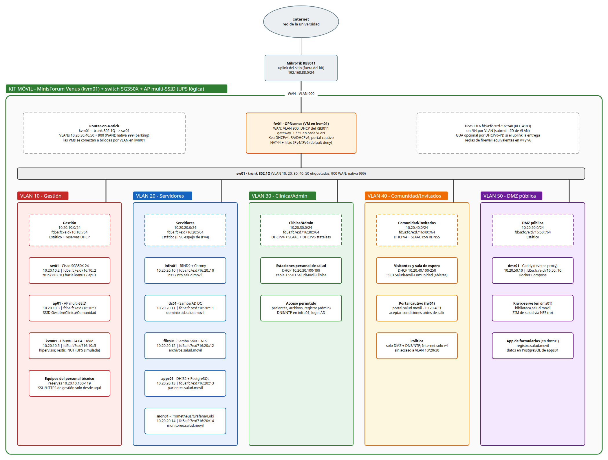

# Kit móvil de atención primaria en salud

## Documento de arquitectura inicial (punto de partida) - v0.1

**Proyecto final - Plataformas I - 2026-2** · Organización: `kitsalud-movil-plats1`

Este documento fija las decisiones iniciales de diseño del kit: tecnologías por servicio, topología física y lógica, segmentación, direccionamiento IPv4/IPv6, nombres DNS, supuestos y riesgos. Es la base para la arquitectura (E1) y se irá actualizando por medio de pull requests en el repositorio `docs`. Cada decisión tiene un identificador (`D-xx`), cada supuesto (`S-xx`) y cada pregunta abierta (`Q-xx`), para poder referenciarlos desde issues y el tablero Kanban.

## 1. Contexto y alcance

Una brigada de salud debe desplegar en sitio una infraestructura pequeña que preste servicios clínicos, administrativos y comunitarios **sin depender de Internet**. El kit se compone de un miniservidor con virtualización, un switch administrable y un punto de acceso Wi-Fi. La alimentación segura (UPS) se incluye en el diseño de forma lógica, porque no se cuenta con el equipo físico. El enlace a Internet del sitio es un recurso opcional; en el laboratorio se simula con un router MikroTik conectado a la red de la universidad.

**Dentro del alcance de esta versión:**

- Diseño lógico y físico, segmentación, plan IPv4/IPv6 y nombres de servicio.
- Selección de tecnologías por requisito (R1-R12) y su relación con las pruebas (P1-P13).
- Dimensionamiento preliminar (cómputo, almacenamiento, red y energía).
- Estructura de la organización y de los repositorios.

**Fuera del alcance de esta versión:** configuración detallada de cada servicio (E2), guía de operación (E3), matriz de seguridad definitiva (E4) y tablero Kanban.

## 2. Requerimientos y trazabilidad

### 2.1 Requisitos técnicos

| # | Requisito | Solución propuesta | Componente |
|---|---|---|---|
| R1 | DHCPv4 y provisión IPv6 | Kea DHCPv4 de OPNsense con reservas; RA con SLAAC + RDNSS; DHCPv6 stateless en clínica | fw01 |
| R2 | DNS interno dual-stack | BIND9 autoritativo para `salud.movil` (A, AAAA, PTR v4/v6), recursivo solo para redes internas | infra01 |
| R3 | NTP | Chrony como servidor (`ntp.salud.movil`), `local stratum 10` sin Internet; el resto de nodos sincroniza contra él | infra01 |
| R4 | Firewall y segmentación | VLAN 802.1Q + reglas OPNsense por interfaz, default deny, reglas espejo IPv4/IPv6 | fw01, sw01 |
| R5 | Portal cautivo | Captive Portal de OPNsense en VLAN 40 (aceptación de condiciones) | fw01 |
| R6 | Aplicación de pacientes | DHIS2 (Docker) + PostgreSQL; login del personal vía LDAP (Samba AD) | apps01 |
| R7 | Portal de literatura | Kiwix-serve con archivos ZIM de salud | dmz01 |
| R8 | Formularios de prerregistro | App propia ligera (FastAPI/Flask). Datos en PostgreSQL de apps01; consulta solo personal clínico autenticado | dmz01, apps01 |
| R9 | Almacenamiento compartido | SMB (Samba, autenticación AD) para documentos y exportaciones; NFS de solo lectura para contenido ZIM | files01 |
| R10 | Identidad centralizada | Samba AD DC (`ad.salud.movil`); integra Grafana, DHIS2, SMB y la vista de administración de formularios | dc01 |
| R11 | Backups y restauración | restic cifrado a un disco distinto del principal; dumps de BD y configuraciones; retención 7d/4s/3m | kvm01 |
| R12 | Registros y monitoreo | Prometheus (node, blackbox, snmp exporters), Loki + Alloy (syslog/journal), Grafana | mon01 |

### 2.2 Pruebas de aceptación: cómo se demostrarán

| # | Prueba | Evidencia prevista |
|---|---|---|
| P1 | Cliente comunitario | `ip a`, `ip -6 route`, `resolvectl status` / `ipconfig /all` en un cliente de VLAN 40 |
| P2 | DNS | `dig A`/`dig AAAA biblioteca.salud.movil`, acceso por navegador sin IP |
| P3 | Aislamiento | `curl`/`nc` desde VLAN 40 hacia apps01 y fw01 GUI → bloqueado (log del firewall) |
| P4 | Acceso público local | Desde VLAN 40: `biblioteca.salud.movil` y `registro.salud.movil` accesibles |
| P5 | Portal cautivo | Cliente nuevo redirigido a `portal.salud.movil` |
| P6 | Aplicación clínica | Usuario AD del grupo `clinicos` registra y consulta un paciente ficticio en DHIS2 |
| P7 | Identidad | Usuario AD inicia sesión en Grafana (y SMB) |
| P8 | Tiempo | `chronyc sources`/`tracking` en dos o más nodos apuntando a infra01 |
| P9 | Pérdida de Internet | Desconectar el RB3011 (VLAN 900): DNS, NTP, DHIS2, formularios y biblioteca siguen funcionando |
| P10 | Firewall IPv6 | `curl -6` permitido (VLAN 40 → DMZ) y bloqueado (VLAN 40 → VLAN 20) |
| P11 | Restauración | Borrar un archivo del share o una tabla de prueba y restaurarla con `restic restore` |
| P12 | Reinicio | Reinicio de kvm01: VMs con `autostart` y servicios `systemd`/`restart: unless-stopped` levantan solos |
| P13 | Diagnóstico | Falla inducida (p. ej. BIND9 detenido); se localiza con Grafana/Loki y `systemctl`/`journalctl` |

### 2.3 Entregables y repositorio responsable

| Entregable | Repositorio |
|---|---|
| E1 Arquitectura, E3 Operación, E4 Matriz de seguridad, E5 Respaldo, E6 Evidencias | `docs` |
| E2 Guía de despliegue | `docs` (narrativa) + README de cada repositorio técnico |
| E7 Repositorio técnico | `network`, `platform`, `apps`, `observability` |
| E8 Sustentación | `docs/sustentacion` |

## 3. Supuestos

| ID | Supuesto | Impacto si es falso |
|---|---|---|
| S-01 | El miniservidor es un MinisForum Venus con características similares a: CPU 8C/16T (Ryzen 7/9), 32-64 GB RAM, 2 ranuras NVMe y 1 NIC de 2.5 GbE. El modelo exacto está por confirmar | Reajustar el dimensionamiento. Con dos NIC, la WAN puede ir directa y no como VLAN 900 |
| S-02 | El laboratorio presta un switch administrable (Cisco SG350X-24 u otro similar) y el MikroTik RB3011 | Usar otro switch 802.1Q; el uplink puede ser directo a la red de la universidad |
| S-03 | Habrá un AP con varios SSID etiquetados en VLAN (802.1Q). El modelo está por definir | Sin multi-SSID, la red clínica inalámbrica pasaría a ser solo cableada |
| S-04 | El uplink del sitio entrega IPv4 por DHCP con NAT. No hay garantía de un prefijo IPv6 global | Si entrega DHCPv6-PD, se agrega GUA (ver 8.1) |
| S-05 | La demostración se hace en el laboratorio; el "sitio remoto" se simula | Ninguno |
| S-06 | La carga esperada es de 5-10 dispositivos del personal y hasta 50 dispositivos simultáneos de la comunidad | Ampliar el pool de invitados a /23 y el AP |
| S-07 | **No se cuenta con UPS física.** La alimentación segura se implementa solo de forma lógica: NUT con el driver `dummy-ups` simula los eventos de la UPS (corte, batería baja) y dispara el apagado ordenado | Si se consigue una UPS con USB, solo se cambia el driver de NUT; el procedimiento no cambia |
| S-08 | Todo el software es libre. Windows solo aparece como cliente opcional para unirse al dominio | Ninguno |
| S-09 | `salud.movil` es un dominio interno (no es un TLD público), así que no hay certificados públicos | Hace falta una CA interna (D-16) |
| S-10 | Todos los datos de pacientes que se usen son ficticios | Ninguno |

## 4. Decisiones de diseño

| ID | Decisión | Alternativas descartadas | Justificación |
|---|---|---|---|
| D-01 | Kit = MinisForum Venus + switch administrable + AP multi-SSID; UPS solo lógica (S-07) | Varios miniservidores | Un solo nodo es más portable y consume menos; la modularidad se logra con VMs por rol |
| D-02 | Router/firewall **OPNsense** como VM en router-on-a-stick | MikroTik, pfSense, Linux+nftables | Portal cautivo integrado, reglas v4/v6 en la misma interfaz, Kea/RA/DHCPv6, configuración exportable en XML |
| D-03 | El RB3011 queda **fuera del kit** y actúa como uplink del sitio. El CCR2004 no se usa | CCR2004 como core | OPNsense ya enruta todas las VLAN. Un segundo salto L3 agrega complejidad sin aportar nada. Desconectar el RB3011 sirve como prueba P9 |
| D-04 | Ubuntu Server 24.04 LTS + KVM/libvirt; aplicaciones en Docker Compose dentro de VMs | Proxmox VE, solo Docker | Continuidad con la experiencia del grupo; VMs para aislar roles; contenedores para desplegar apps de forma reproducible |
| D-05 | Identidad: **Samba AD DC** | Windows Server AD, FreeIPA, OpenLDAP | Compatible con AD y LDAP para las apps; liviano; permite unir un cliente Windows |
| D-06 | Pacientes: **DHIS2** | OpenMRS | Es la sugerida por el enunciado; tiene tracker de pacientes, imagen Docker oficial y soporte LDAP |
| D-07 | Formularios: **app propia ligera** con datos en PostgreSQL de apps01 | LimeSurvey, formulario DHIS2 | Da control total de dónde se guardan los datos y quién los consulta; la DMZ no guarda datos sensibles |
| D-08 | Biblioteca: **Kiwix-serve** | CMS, sitio estático | Funciona sin conexión y usa contenido médico listo (WikiMed, MedlinePlus) |
| D-09 | Observabilidad: **Prometheus + Grafana + Loki** | Zabbix, Uptime Kuma | El grupo ya lo conoce; métricas y logs quedan en un mismo panel |
| D-10 | Backups con **restic** cifrado en un segundo disco; copia externa con rclone cuando haya Internet | NAS, solo snapshots | Cumple "otro medio", cifrado, deduplicación y restauración granular |
| D-11 | IPv4 `10.20.<VLAN>.0/24`, gateway `.1` | `192.168.<VLAN>.0/24` | Evita solaparse con el uplink `192.168.88.0/24` y se resume en una sola regla `10.20.0.0/16` |
| D-12 | IPv6 **ULA `fd5a:fc7e:d716::/48`** con un /64 por VLAN; GUA opcional vía DHCPv6-PD | Solo GUA, `2001:db8::/32` | Direcciones estables sin Internet. No se usa `2001:db8::/32` porque es el prefijo reservado para documentación (RFC 3849) |
| D-13 | Organización con repos por dominio: `.github`, `docs`, `network`, `platform`, `apps`, `observability` | Monorepo, un repo por servicio | Da trazabilidad por área, permisos por equipo y PRs pequeños |
| D-14 | WAN de OPNsense como **VLAN 900** sobre el mismo trunk | NIC USB adicional | Funciona con una sola NIC (S-01). Si hay una segunda NIC, se usa directa |
| D-15 | Servicios públicos en una **DMZ (VLAN 50)** separada de la red de servidores | Publicar desde la VLAN 20 | Los invitados solo pueden alcanzar la DMZ, así que una vulnerabilidad en una app pública no expone la VLAN 20 |
| D-16 | TLS con **CA interna** (Caddy `tls internal` o step-ca). El certificado raíz se instala en equipos clínicos y de gestión | HTTP plano | Protege credenciales y datos clínicos en tránsito (ver Q-05 para invitados) |
| D-17 | Credenciales fuera de Git: `.env.example` + `ansible-vault`/`sops` | Contraseñas en README | Cumple la política de "no contraseñas en texto plano" |

## 5. Arquitectura física

### 5.1 Inventario del kit

| Equipo | Rol | Notas |
|---|---|---|
| MinisForum Venus (`kvm01`) | Hipervisor KVM con todas las VMs | Disco 1: NVMe con SO y VMs. Disco 2: NVMe/SSD USB para backups (restic) |
| Switch Cisco SG350X-24 (`sw01`) | Conmutación L2, trunk 802.1Q | Alternativa más compacta en R-02 |
| AP multi-SSID (`ap01`) | Wi-Fi con SSID por VLAN | Modelo por definir (S-03) |
| UPS (lógica) | Alimentación segura y apagado controlado | No se cuenta con el equipo. Se simula con NUT `dummy-ups` en kvm01 (ver 12) |
| _Fuera del kit:_ MikroTik RB3011 | Uplink del sitio (NAT a la red de la universidad) | `192.168.88.0/24` |

### 5.2 Conexiones y puertos del switch (preliminar)

| Puerto sw01 | Conectado a | Modo | VLAN |
|---|---|---|---|
| gi1/0/1 | kvm01 (NIC 2.5 GbE) | Trunk | 10, 20, 30, 40, 50, 900 etiquetadas; nativa 999 |
| gi1/0/2 | ap01 | Trunk | 10 nativa (gestión del AP); 30, 40 etiquetadas |
| gi1/0/3 | RB3011 (uplink) | Acceso | 900 |
| gi1/0/4-8 | Estaciones clínicas | Acceso | 30 |
| gi1/0/9-10 | Estaciones de gestión | Acceso | 10 |
| resto | Sin uso | Acceso, `shutdown` | 999 |

### 5.3 SSID

| SSID | VLAN | Seguridad |
|---|---|---|
| `SaludMovil-Comunidad` | 40 | Abierta + portal cautivo, con aislamiento de clientes |
| `SaludMovil-Clinica` | 30 | WPA3/WPA2-Personal. 802.1X contra AD como mejora (Q-04) |
| `SaludMovil-Gestion` | 10 | WPA3-Personal, uso exclusivo del personal técnico |

## 6. Arquitectura lógica

Fuente editable del diagrama en Lucidchart: <https://lucid.app/lucidchart/6bf45f05-e5a8-42cb-a7af-6a79dc097531/edit>. La especificación versionada está en `diagramas/diagrama-logico.lucid.json` y se regenera con `tools/gen_lucid.py`.

**Router-on-a-stick.** La NIC de kvm01 es un trunk 802.1Q hacia sw01. En kvm01, un bridge Linux con VLAN (`br0`, `vlan_filtering=1`) entrega el trunk completo a fw01, y cada VM de servicio queda como puerto de acceso en su VLAN. OPNsense es el único gateway L3: cada VLAN tiene su interfaz con `.1` / `::1`.

**Dependencias entre servicios (orden de arranque):**

1. kvm01 (red, bridges)
2. fw01 (gateway, DHCP, RA)
3. infra01 (DNS, NTP)
4. dc01 (AD, necesita DNS y tiempo)
5. files01 (SMB con AD, NFS)
6. apps01 (PostgreSQL → DHIS2, necesita DNS y LDAP)
7. dmz01 (Caddy, Kiwix con NFS, formularios con BD en apps01)
8. mon01 (Prometheus, Loki, Grafana con LDAP)

El orden se controla con el `autostart` de libvirt más retardos de arranque, y con `depends_on`/healthchecks en Compose.

## 7. Plan IPv4

### 7.1 Segmentos

| VLAN | Nombre | Subred | Gateway | Asignación | Pool DHCP |
|---|---|---|---|---|---|
| 10 | Gestión | 10.20.10.0/24 | 10.20.10.1 | Estática + reservas | 10.20.10.100-119 (solo reservas) |
| 20 | Servidores | 10.20.20.0/24 | 10.20.20.1 | Estática | - |
| 30 | Clínica/Administrativa | 10.20.30.0/24 | 10.20.30.1 | DHCPv4 | 10.20.30.100-199 (lease 8 h) |
| 40 | Comunidad/Invitados | 10.20.40.0/24 | 10.20.40.1 | DHCPv4 | 10.20.40.100-250 (lease 1 h) |
| 50 | DMZ pública | 10.20.50.0/24 | 10.20.50.1 | Estática | - |
| 900 | WAN (tránsito) | 192.168.88.0/24 | 192.168.88.1 (RB3011) | DHCP del RB3011 | - |
| 999 | Parking | - | - | Sin L3 | - |

**Convención de hosts:** `.1` gateway, `.2-.9` equipos de red e hipervisor, `.10-.49` servidores, `.100-.250` clientes.

**NAT:** una sola regla de NAT de salida (masquerade) de `10.20.0.0/16` hacia la interfaz WAN. Va aparte del filtrado entre VLAN, que se hace con reglas por interfaz.

### 7.2 Direcciones de infraestructura

| Host | Rol | IPv4 | IPv6 |
|---|---|---|---|
| fw01 | OPNsense (gateway de cada VLAN) | 10.20.X.1 | fd5a:fc7e:d716:X::1 |
| sw01 | Switch (gestión) | 10.20.10.2 | fd5a:fc7e:d716:10::2 |
| ap01 | AP (gestión) | 10.20.10.3 | fd5a:fc7e:d716:10::3 |
| kvm01 | Hipervisor (gestión) | 10.20.10.5 | fd5a:fc7e:d716:10::5 |
| infra01 | BIND9 + Chrony | 10.20.20.10 | fd5a:fc7e:d716:20::10 |
| dc01 | Samba AD DC | 10.20.20.11 | fd5a:fc7e:d716:20::11 |
| files01 | Samba SMB + NFS | 10.20.20.12 | fd5a:fc7e:d716:20::12 |
| apps01 | DHIS2 + PostgreSQL | 10.20.20.13 | fd5a:fc7e:d716:20::13 |
| mon01 | Prometheus, Grafana, Loki | 10.20.20.14 | fd5a:fc7e:d716:20::14 |
| dmz01 | Caddy, Kiwix, formularios | 10.20.50.10 | fd5a:fc7e:d716:50::10 |

## 8. Plan IPv6

### 8.1 Estrategia

- **Prefijo interno:** ULA `fd5a:fc7e:d716::/48`. El Global ID de 40 bits se generó aleatoriamente, como pide la RFC 4193. Es estable y no depende del proveedor, así que el kit funciona igual con o sin Internet.
- **Subredes:** un /64 por VLAN, y el ID de subred es el número de VLAN (`fd5a:fc7e:d716:<VLAN>::/64`). Queda espacio para 65 536 subredes.
- **Servidores:** direcciones estáticas que espejan el último octeto IPv4 (`10.20.20.10` ↔ `fd5a:fc7e:d716:20::10`). Esto facilita la lectura de reglas, zonas DNS y logs.
- **GUA opcional:** si el uplink entrega un prefijo por DHCPv6-PD, OPNsense lo reparte como segundo prefijo solo en las VLAN 20, 30 y 50. Las políticas se escriben sobre alias, no sobre prefijos, así que no cambian.

### 8.2 Asignación por segmento

| VLAN | Prefijo | Mecanismo | Flags RA | DNS |
|---|---|---|---|---|
| 10 | fd5a:fc7e:d716:10::/64 | Estático + SLAAC | M=0, O=0 | RDNSS |
| 20 | fd5a:fc7e:d716:20::/64 | Estático (sin SLAAC en servidores) | M=0, O=0 | Estático |
| 30 | fd5a:fc7e:d716:30::/64 | SLAAC + DHCPv6 stateless (DNS, dominio de búsqueda, NTP) | M=0, O=1 | RDNSS + DHCPv6 |
| 40 | fd5a:fc7e:d716:40::/64 | SLAAC + RDNSS (Android no tiene cliente DHCPv6) | M=0, O=0 | RDNSS |
| 50 | fd5a:fc7e:d716:50::/64 | Estático | M=0, O=0 | Estático |

El DNS anunciado es `fd5a:fc7e:d716:20::10` (infra01), igual que en DHCPv4, donde se anuncia `10.20.20.10`.

### 8.3 Seguridad IPv6

- Las reglas de firewall son **equivalentes en v4 y v6**. Se escriben sobre alias con miembros de ambas familias (p. ej. `H_APPS01 = 10.20.20.13, fd5a:fc7e:d716:20::13`).
- Se permite el ICMPv6 imprescindible (NDP, RA/RS, Packet Too Big, Time Exceeded y Parameter Problem, según la RFC 4890). El eco ICMPv6 solo se permite desde la VLAN 10 y para las pruebas.
- El portal cautivo de OPNsense solo cubre IPv4. Por eso, en la VLAN 40, IPv6 **solo** llega a la DMZ, DNS y NTP. No hay salida a Internet por IPv6 para invitados y así IPv6 no queda como una vía que se salte el portal.
- Se activa RA Guard y DHCPv6 Guard en los puertos de acceso del switch, si el firmware lo soporta, para evitar RA falsos.

## 9. DNS y nombres de servicio

Zona autoritativa `salud.movil` en infra01. Las zonas inversas son `10.20.in-addr.arpa` y `6.1.7.d.e.7.c.f.a.5.d.f.ip6.arpa`. La subzona `ad.salud.movil` se delega a dc01 (Samba AD). La recursión solo se permite a `10.20.0.0/16` y `fd5a:fc7e:d716::/48`. Los forwarders externos se usan solo cuando hay Internet; sin Internet, las zonas locales siguen respondiendo.

| Nombre | Destino | A | AAAA |
|---|---|---|---|
| `pacientes.salud.movil` | apps01 (DHIS2) | 10.20.20.13 | fd5a:fc7e:d716:20::13 |
| `biblioteca.salud.movil` | dmz01 (Kiwix) | 10.20.50.10 | fd5a:fc7e:d716:50::10 |
| `registro.salud.movil` | dmz01 (formularios) | 10.20.50.10 | fd5a:fc7e:d716:50::10 |
| `ntp.salud.movil` | infra01 | 10.20.20.10 | fd5a:fc7e:d716:20::10 |
| `archivos.salud.movil` | files01 | 10.20.20.12 | fd5a:fc7e:d716:20::12 |
| `ns1.salud.movil` | infra01 | 10.20.20.10 | fd5a:fc7e:d716:20::10 |
| `monitoreo.salud.movil` | mon01 (Grafana) | 10.20.20.14 | fd5a:fc7e:d716:20::14 |
| `portal.salud.movil` | fw01 (portal cautivo) | 10.20.40.1 | - |
| `dc01.ad.salud.movil` | dc01 | 10.20.20.11 | fd5a:fc7e:d716:20::11 |
| `fw01`, `sw01`, `ap01`, `kvm01` `.salud.movil` | Gestión | 10.20.10.1/.2/.3/.5 | fd5a:fc7e:d716:10::1/2/3/5 |

## 10. Servicios y tecnologías

| VM | SO / runtime | Servicios | vCPU | RAM | Disco |
|---|---|---|---|---|---|
| fw01 | OPNsense 26.x | Enrutamiento, filtro v4/v6, NAT, Kea DHCPv4, RA/DHCPv6, portal cautivo | 2 | 4 GB | 32 GB |
| infra01 | Ubuntu 24.04 | BIND9, Chrony | 1 | 1 GB | 16 GB |
| dc01 | Ubuntu 24.04 | Samba AD DC | 2 | 2 GB | 32 GB |
| files01 | Ubuntu 24.04 | Samba (miembro del dominio), NFS | 1 | 2 GB | 32 GB + 200 GB de datos |
| apps01 | Ubuntu 24.04 + Docker | DHIS2, PostgreSQL (DHIS2 y formularios), Caddy interno | 4 | 10 GB | 120 GB |
| dmz01 | Ubuntu 24.04 + Docker | Caddy, Kiwix-serve, app de formularios | 2 | 3 GB | 40 GB |
| mon01 | Ubuntu 24.04 + Docker | Prometheus, Alertmanager, Loki, Grafana | 2 | 4 GB | 80 GB |
| kvm01 (host) | Ubuntu 24.04 | KVM/libvirt, restic, NUT, node_exporter | - | 2 GB reservados | - |

Todos los nodos Linux llevan `node_exporter`, Alloy (envío de journal y logs a Loki), `chrony` apuntando a `ntp.salud.movil`, SSH solo con llave, cuentas individuales y sin login directo de root.

## 11. Matriz de flujos preliminar

Política por defecto: **denegar todo el tráfico entre VLAN y registrarlo**. Todas las reglas aplican a IPv4 e IPv6, salvo que se indique otra cosa.

| ID | Origen | Destino | Puertos | Justificación |
|---|---|---|---|---|
| F-01 | VLAN 10 | Todas las VLAN, fw01 | 22, 443, 8443, 161/udp, ICMP | Administración (SSH, GUI, SNMP) solo desde gestión |
| F-02 | VLAN 10, 30, 40, 50, 20 | infra01 | 53 tcp/udp, 123/udp | DNS y NTP internos |
| F-03 | VLAN 30 | apps01 | 443 | DHIS2 (`pacientes`) |
| F-04 | VLAN 30 | files01 | 445 | Recurso SMB `archivos` |
| F-05 | VLAN 30 | dmz01 | 443 | Formularios (vista del personal) y biblioteca |
| F-06 | VLAN 30 | dc01 | 88, 389, 464, 636, 445, 135, 49152-65535 | Solo si se unen equipos al dominio (Q-03) |
| F-07 | VLAN 40 | dmz01 | 80, 443 | Biblioteca y formularios públicos |
| F-08 | VLAN 40 | fw01 | 8000/tcp (portal), 53 | Portal cautivo |
| F-09 | VLAN 40 | Internet | any (solo IPv4, tras autenticarse en el portal) | Conectividad comunitaria |
| F-10 | dmz01 | apps01 | 5432 | BD de formularios (usuario con permisos solo de `INSERT` desde la DMZ) |
| F-11 | dmz01 | files01 | 2049 | NFS de solo lectura con el contenido ZIM |
| F-12 | dmz01, apps01, mon01, files01 | dc01 | 636 | LDAPS para autenticación |
| F-13 | Todas las VMs | mon01 | 3100 | Envío de logs a Loki |
| F-14 | mon01 | Todos los nodos | 9100, 9115, 161/udp, 443 | Scraping de métricas, sondas blackbox, SNMP |
| F-15 | fw01, sw01, ap01 | mon01 | 514/udp | Syslog de equipos de red |
| F-16 | VLAN 20, 50 | Internet | 80, 443 | Actualizaciones de paquetes e imágenes (solo con Internet) |
| F-17 | infra01 | Internet | 53, 123/udp | Forwarders DNS y fuentes NTP externas |
| F-18 | Todas | Todas | ICMPv6 NDP/PMTU | Funcionamiento de IPv6 (RFC 4890) |
| F-19 | VLAN 40 | VLAN 10, 20, 30, fw01 GUI | any | **Bloqueado y registrado** (prueba P3/P10) |

## 12. Dimensionamiento y energía (preliminar)

- **Cómputo:** 14 vCPU asignadas sobre 16 hilos (sobreasignación baja). La carga pico esperada es la de DHIS2 durante el registro.
- **Memoria:** 28 GB asignados más 2 GB para el host. **Mínimo 32 GB; se recomiendan 64 GB** para poder crecer (p. ej. un DNS secundario o más usuarios en DHIS2).
- **Almacenamiento:** unos 350 GB para VMs y 200 GB de datos → NVMe de 1 TB. Backups en un segundo disco de 1 TB, que con retención 7d/4s/3m y deduplicación da un uso estimado de 150-300 GB.
- **Clientes:** 5-10 del personal y hasta 50 de la comunidad. El pool de invitados tiene 151 direcciones con lease de 1 h.
- **Red:** trunk de 2.5 GbE (el switch negocia 1 GbE); AP Wi-Fi 5/6 con un mínimo recomendado de 50 clientes simultáneos.

| Equipo | Consumo típico | Pico |
|---|---|---|
| MinisForum Venus | 35 W | 90 W |
| Switch SG350X-24 | 25 W | 30 W |
| AP (PoE/inyector) | 10 W | 15 W |
| **Total** | **≈ 70 W** | **≈ 135 W** |

**Alimentación segura (implementación lógica).** No se cuenta con UPS física, así que el diseño la trata como un componente lógico:

- **Dimensionamiento de referencia:** para la carga típica de unos 70 W, una UPS de 1000 VA/600 W (unos 200 Wh nominales, de los que se aprovecha cerca del 60 %) daría una **autonomía estimada de 60 a 90 minutos**.
- **Simulación:** en kvm01, NUT usa el driver `dummy-ups` con un archivo de estado. Al cambiar el estado a `OB` (en batería) y luego a `LB` (batería baja), se simulan el corte de energía y la batería baja.
- **Apagado ordenado:** `upsmon` ejecuta el mismo script de apagado que se usaría con una UPS real. El script apaga las VMs en orden inverso al de arranque (sección 6) y luego el host.
- **Paso a hardware real:** si se consigue una UPS con USB, solo se cambia el driver de NUT (p. ej. `usbhid-ups`); el procedimiento no cambia.

## 13. Riesgos y preguntas abiertas

| ID | Riesgo / pregunta | Mitigación / siguiente paso |
|---|---|---|
| R-01 | Un único hipervisor es un punto único de falla | Backups probados, apagado ordenado y procedimiento de restauración (P11). Documentar un segundo nodo como evolución |
| R-02 | El SG350X-24 es de 1U y pesado para un kit portátil | Alternativa compacta: switch de 8-10 puertos gestionable con PoE (p. ej. SG350-10P o MikroTik CSS/CRS) |
| R-03 | DHIS2 consume mucha RAM | Limitar el heap de la JVM y monitorear. Con 32 GB, apagar servicios no esenciales durante las pruebas |
| R-04 | Portal cautivo solo IPv4 | Política IPv6 restrictiva en la VLAN 40 (8.3) |
| R-05 | Actualizaciones sin Internet | Caché de paquetes APT (apt-cacher-ng) e imágenes Docker guardadas. Ventana de actualización documentada en E3 |
| Q-01 | ¿Modelo exacto del MinisForum Venus (RAM, NIC)? | Confirmar con el laboratorio |
| Q-02 | ¿Qué AP hay disponible? | Confirmar; requiere multi-SSID + 802.1Q |
| Q-03 | ¿Se unirá un cliente Windows al dominio? | Si es así, habilitar F-06 |
| Q-04 | ¿El SSID clínico usará 802.1X (RADIUS contra AD)? | Mejora opcional (FreeRADIUS o NPS) |
| Q-05 | ¿TLS para invitados? `registro` maneja datos personales | Opciones: HTTPS con CA interna (con advertencia en el navegador) o HTTP solo para la biblioteca. Decidir en el hito de Wi-Fi y seguridad |
| Q-06 | ¿Acceso del docente a los repositorios? | Los repos serán privados; hay que invitar al docente como colaborador de la organización |

## 14. Organización del trabajo

**Organización GitHub:** `kitsalud-movil-plats1`

| Repositorio | Contenido |
|---|---|
| `.github` | Perfil de la organización y plantillas de issues y PR |
| `docs` | Arquitectura, decisiones, diagramas, guías E2-E6 y sustentación |
| `network` | Configuración exportada de OPNsense (sin secretos), switch y AP |
| `platform` | kvm01 (libvirt, netplan), infra01 (BIND9, Chrony), dc01, files01, backups (restic), Ansible |
| `apps` | Compose de DHIS2, dmz01 (Caddy, Kiwix, formularios) |
| `observability` | Prometheus, reglas de alerta, dashboards de Grafana, Loki/Alloy |

**Flujo de trabajo:**

- `main` protegida; ramas `feat/<tema>` o `fix/<tema>`.
- PR con al menos una revisión y referencia al issue y al ID de decisión o requisito (p. ej. `R2`, `D-12`).
- Commits en español e imperativo.
- Nunca se suben secretos: `.gitignore` los excluye; `.env.example` sirve de plantilla.

## 15. Próximos pasos por hito

| Hito | Tareas iniciales |
|---|---|
| Diseño | Revisar este documento en grupo, resolver Q-01 a Q-06, confirmar hardware, crear el tablero Kanban |
| Servicios base | Instalar kvm01 y bridges; fw01 con VLAN, DHCP y RA; infra01 (DNS y NTP); dc01 (AD); acceso administrativo |
| Almacenamiento y aplicaciones | files01 (SMB/NFS), DHIS2, Kiwix, app de formularios, TLS interno |
| Wi-Fi y seguridad | AP y SSID, portal cautivo, matriz de flujos v4/v6 definitiva (E4) |
| Resiliencia | restic y restauración, apagado ordenado con NUT simulado, autostart, observabilidad, prueba sin Internet |
| Entrega final | Guías E2/E3, evidencias P1-P13, limpieza del repositorio, sustentación |
