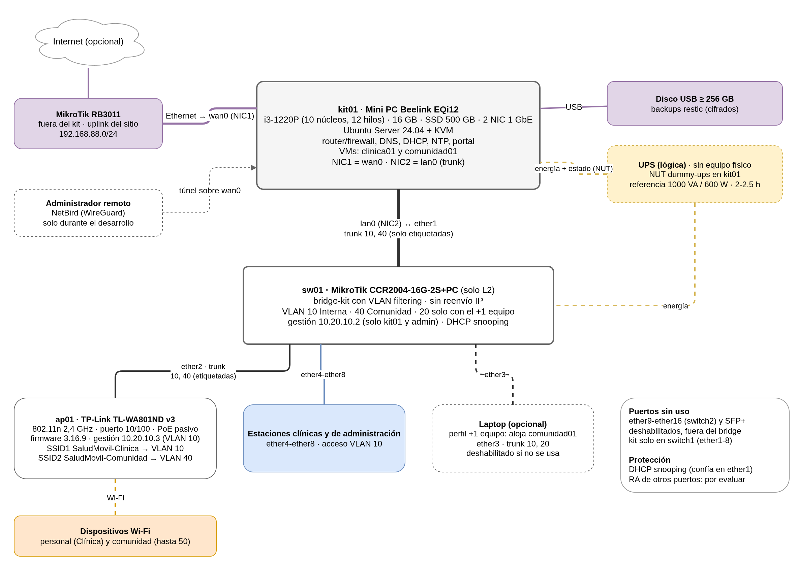
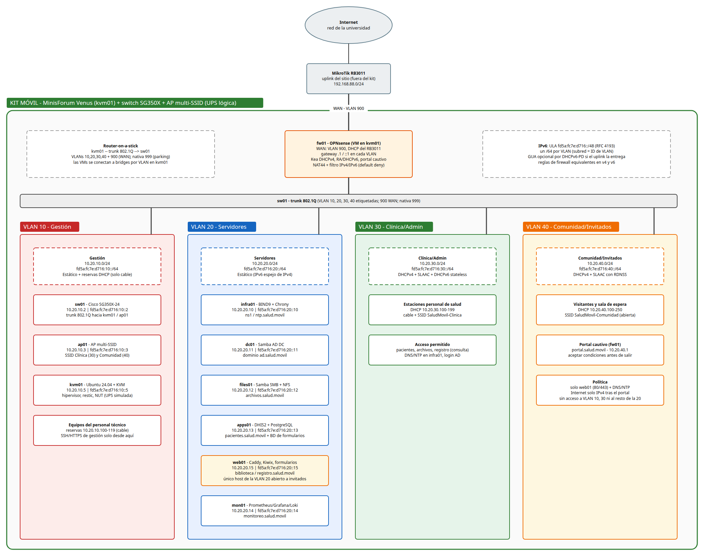

# Kit móvil de atención primaria en salud

## Documento de arquitectura inicial (punto de partida) - v0.8

**Proyecto final - Plataformas I - 2026-2** · Organización `kitsalud-movil-plats1`

Este documento fija las decisiones de diseño del kit, es decir, las tecnologías por servicio, recursos necesarios, topología física y lógica, segmentación, direccionamiento IPv4/IPv6, nombres DNS, supuestos, restricciones y riesgos. Es la base para la arquitectura (E1) y se actualiza mediante pull requests en el repositorio `docs`. Cada decisión tiene un identificador (`D-xx`), cada supuesto (`S-xx`), cada restricción (`C-xx`) y cada pregunta abierta (`Q-xx`), para poder referenciarlos desde issues y el tablero Kanban. Los cambios entre versiones están en la sección 17.

## 1. Contexto y alcance

Una brigada de salud debe desplegar en sitio una infraestructura pequeña que preste servicios clínicos, administrativos y comunitarios **sin depender de Internet**. El kit se compone de **un mini PC** (Beelink EQi12), **un MikroTik CCR2004** que hace de switch y **un punto de acceso Wi-Fi** (TP-Link TL-WA801ND). El mini PC es a la vez el router/firewall del kit y el hipervisor de dos máquinas virtuales, una para los servicios clínicos y otra para los comunitarios. Si hace falta más memoria, se agrega como máximo **un equipo más** (una laptop del grupo). La alimentación segura (UPS) se incluye en el diseño de forma lógica, porque no se cuenta con el equipo físico. El enlace a Internet del sitio es opcional; en el laboratorio se usa la red del laboratorio (Q-09).

**Contenido para la comunidad.** Los contenidos deben servirle tanto a la comunidad como al personal de salud. Por eso, además de la literatura de salud (R7), el kit ofrece una **biblioteca educativa para niños** y contenido de salud y comunitario en **audio y video** (sección 10.5).

El criterio que guía el diseño es el del enunciado, que pide construir una plataforma **pequeña, segura, reproducible y útil** con la menor cantidad de tecnologías posible. Por eso hay un solo sistema operativo (Ubuntu Server 24.04) en el host y en las VMs, dos VLAN físicas, dos VMs y, para cada requisito, la herramienta más simple que lo cumple.

**Dentro del alcance de esta versión**

- Diseño lógico y físico, segmentación, plan IPv4/IPv6 (incluidas las direcciones link-local) y nombres de servicio.
- Selección de tecnologías por requisito (R1-R12) y su relación con las pruebas (P1-P13).
- Catálogo de VMs, criticidad de los servicios, perfiles por tipo de misión y dimensionamiento (cómputo, almacenamiento, red y energía).
- Estructura de la organización, repositorios y calendario.

**Fuera del alcance de esta versión.** Configuración detallada de cada servicio (E2), guía de operación (E3), matriz de seguridad definitiva (E4) y tablero Kanban.

## 2. Requerimientos y trazabilidad

### 2.1 Requisitos técnicos

| # | Requisito | Solución propuesta | Dónde |
|---|---|---|---|
| R1 | DHCPv4 y provisión IPv6 | Kea DHCPv4 con pools y reservas por MAC. radvd anuncia SLAAC con M=0, O=1 y Kea DHCPv6 stateless entrega DNS, dominio y NTP. Servidores con dirección estática | kit01 |
| R2 | DNS interno dual-stack | BIND9 autoritativo para `salud.movil` (A, AAAA, PTR v4/v6), recursivo solo para las redes internas | kit01 |
| R3 | NTP | Chrony como servidor (`ntp.salud.movil`). Con Internet se sincroniza con fuentes externas (`pool.ntp.org`); sin Internet sigue como referencia con `local stratum 10`. VMs, switch y AP sincronizan contra él | kit01 |
| R4 | Firewall y segmentación | Dos VLAN 802.1Q + red de servidores virtual. **nftables** en una tabla `inet` (IPv4 e IPv6), denegar por defecto y registrar. NAT en una tabla aparte | kit01, sw01 |
| R5 | Portal cautivo | Portal propio con nginx y un set de MAC en nftables con expiración. Cubre IPv4 **e IPv6** | kit01 |
| R6 | Aplicación de pacientes | DHIS2 (Docker) + PostgreSQL, con cuentas locales | clinica01 |
| R7 | Portal de literatura | Kiwix (salud y contenido infantil) y Jellyfin (audio y video de salud y para la comunidad) | comunidad01 |
| R8 | Formularios de prerregistro | App propia mínima y asistida. Los datos se guardan en PostgreSQL de clinica01 y los consulta solo el grupo AD `clinicos` | comunidad01 → clinica01 |
| R9 | Almacenamiento compartido | SMB con autenticación AD, con los recursos `archivos` (documentos y exportaciones) y `contenido` (medios y ZIM que se publican en comunidad01) | clinica01 |
| R10 | Identidad centralizada | Samba AD DC (`ad.salud.movil`). La usan SMB, Grafana y la consulta de formularios | clinica01 |
| R11 | Backups y restauración | restic cifrado en un disco USB, en **modelo pull**. kit01 extrae los dumps de cada VM por SSH. Retención 7d/4s/3m | kit01, disco USB |
| R12 | Registros y monitoreo | Prometheus (node y blackbox exporters para disponibilidad, puertos, CPU, memoria y disco) y Grafana. rsyslog centraliza en kit01 los eventos de DHCP (Kea), DNS (BIND9), firewall (`fw-drop`) y autenticación (Samba AD y SSH), además del syslog de sw01 | kit01 |

### 2.2 Cómo se demostrarán las pruebas de aceptación

| # | Prueba | Evidencia prevista |
|---|---|---|
| P1 | Cliente comunitario | `ip a`, `ip -6 route` (`default via fe80::1`), `resolvectl status` / `ipconfig /all` en un cliente de la VLAN 40 |
| P2 | DNS | `dig A` / `dig AAAA biblioteca.salud.movil`, acceso por navegador sin IP. Extremo a extremo por IPv6 desde la red Interna, con `ping -6 biblioteca.salud.movil` y `curl -6 http://biblioteca.salud.movil` |
| P3 | Aislamiento | `curl`/`nc` desde la VLAN 40 hacia `pacientes.salud.movil` y hacia el SSH de kit01 → bloqueado (log `fw-drop` en kit01) |
| P4 | Acceso público local | Desde la VLAN 40, después del portal, `biblioteca`, `videos` y `registro.salud.movil` accesibles |
| P5 | Portal cautivo | Un cliente nuevo es redirigido a `portal.salud.movil`, también sin Internet |
| P6 | Aplicación clínica | Un usuario del personal clínico registra y consulta un paciente ficticio en DHIS2 |
| P7 | Identidad | Un usuario AD inicia sesión en Grafana y en el recurso SMB `archivos` |
| P8 | Tiempo | `chronyc sources`/`tracking` en clinica01, comunidad01 y una estación de la red Interna apuntando a `ntp.salud.movil` |
| P9 | Pérdida de Internet | Se desconecta el cable de `wan0`: DNS, NTP, DHIS2, formularios, biblioteca y videos siguen funcionando |
| P10 | Firewall IPv6 | Desde la VLAN 40, `curl -6` permitido hacia comunidad01 y bloqueado hacia clinica01. Los dos destinos están en la misma red, así que se ve que la regla es por host |
| P11 | Restauración | Borrar un archivo del recurso `archivos` o una tabla de prueba y restaurarla con `restic restore` desde el disco USB |
| P12 | Reinicio | Reinicio de kit01: servicios `systemd`, VMs con `autostart` y contenedores con `restart: unless-stopped` levantan solos |
| P13 | Diagnóstico | Falla inducida (p. ej. BIND9 detenido o PostgreSQL caído); se localiza con Grafana (sonda blackbox), los logs centralizados y `systemctl`/`journalctl` |

### 2.3 Entregables y repositorio responsable

| Entregable | Repositorio |
|---|---|
| E1 Arquitectura, E3 Operación, E4 Matriz de seguridad, E5 Respaldo, E6 Evidencias | `docs` |
| E2 Guía de despliegue | `docs` (narrativa) + README de cada repositorio técnico |
| E7 Repositorio técnico | `network`, `platform`, `apps`, `observability` |
| E8 Sustentación | `docs/sustentacion` |

## 3. Supuestos y restricciones

### 3.1 Supuestos

| ID | Supuesto | Impacto si es falso |
|---|---|---|
| S-01 | El mini PC Beelink EQi12 (Intel Core i3-1220P de 10 núcleos y 12 hilos, 16 GB DDR4, SSD de 500 GB, **dos NIC de 1 GbE**) estará disponible para el desarrollo y la sustentación | Si no estuviera, el mismo diseño corre en una laptop de 16 GB con un adaptador USB-Ethernet para la WAN |
| S-02 | El laboratorio presta el MikroTik CCR2004-16G-2S+PC (usado como switch) y el MikroTik RB3011 (uplink) | Cualquier switch 802.1Q sirve; el uplink puede ser directo a la red de la universidad |
| S-03 | El AP TP-Link TL-WA801ND v3 (firmware 3.16.9) en modo Multi-SSID etiqueta cada SSID con su VLAN (hasta cuatro). Su gestión **recibe** tramas etiquetadas en la VLAN del SSID1 y **responde sin etiqueta** (comprobado en el laboratorio) | ether2 de sw01 es híbrido para aceptar esas respuestas (sección 5.2). Falta comprobar con clientes que los dos SSID salen etiquetados; si el Multi-SSID con VLAN fallara, la red Interna sería solo cableada |
| S-04 | El uplink entrega IPv4 con salida a Internet (por DHCP o con dirección fija, según el sitio). Si anuncia IPv6, el kit no lo usa, porque IPv6 es interno (D-12) y `wan0` no acepta RA. En el laboratorio el uplink es la red `192.168.160.0/24` con dirección fija, DNS `192.168.215.20` y `.30`, y un prefijo IPv6 anunciado por SLAAC (`2001:db8:a:c::/64`) | Si el sitio entrega DHCPv6-PD, se puede agregar GUA más adelante; no cambia las políticas |
| S-05 | La demostración se hace en el laboratorio; el "sitio remoto" se simula | Ninguno |
| S-06 | La carga esperada es de 5-10 dispositivos del personal y hasta 50 dispositivos simultáneos de la comunidad | Ampliar el pool de la comunidad a /23 y agregar un AP |
| S-07 | Todo el software es libre. Windows solo aparece como cliente opcional para unirse al dominio | Ninguno |
| S-08 | `salud.movil` es un dominio interno, fuera de los TLD públicos, así que no hay certificados públicos | Hace falta una CA interna (D-16) |
| S-09 | Todos los datos de pacientes que se usen son ficticios | Ninguno |
| S-10 | El material propio de la comunidad se graba con ella y con su consentimiento; el kit solo lo almacena y lo publica | Jellyfin sigue publicando el contenido médico general |

### 3.2 Restricciones

| ID | Restricción | Consecuencia en el diseño |
|---|---|---|
| C-01 | **No hay UPS física** | Alimentación segura implementada de forma lógica con NUT (`dummy-ups`) y apagado ordenado (13) |
| C-02 | Un solo mini PC de 16 GB; a lo sumo un equipo más | Dos VMs, router en el host, perfiles por misión (10) |
| C-03 | Sin Internet en sitio | Todo servicio esencial es local; las actualizaciones se aplican en base (R-05) |
| C-04 | El equipo de red es prestado por el laboratorio | Las configuraciones se versionan para poder reinstalarlas en cualquier momento |

## 4. Decisiones de diseño

| ID | Decisión | Alternativas descartadas | Justificación |
|---|---|---|---|
| D-01 | Kit = **un mini PC (`kit01`)** + MikroTik CCR2004 como switch (`sw01`) + AP multi-SSID (`ap01`); UPS lógica (C-01). Si falta RAM, se agrega una laptop (10.4) | Varios nodos KVM; un servidor físico por rol | Es lo mínimo que cumple el enunciado. Cada VM conserva su IP y su MAC, así que moverla no cambia el direccionamiento, el DNS ni el firewall |
| D-02 | El **host Ubuntu es el router/firewall**. Nftables, Kea, radvd, BIND9, Chrony y portal cautivo como servicios `systemd` | OPNsense como VM; pfSense; MikroTik | El núcleo de red no depende de ninguna VM. No hay que aprender FreeBSD para el router y se ahorran 3 GB de RAM. Las reglas son archivos de texto versionados, y una sola tabla `inet` aplica a IPv4 e IPv6 |
| D-03 | El RB3011 queda **fuera del kit** como uplink del sitio. El **CCR2004 trabaja solo en capa 2** (`sw01`), con un bridge con VLAN filtering, una sola interfaz de gestión en la VLAN 10 y el reenvío IP desactivado | CCR2004 como router/firewall del kit; RB3011 como switch | Un solo punto de enrutamiento y de política. Si el CCR2004 también enrutara, habría reglas en dos equipos y el tráfico entre VLAN podría saltarse nftables. Como router, además, separaría las reglas IPv4 de las IPv6 y su portal (Hotspot) solo cubre IPv4. Desconectar el uplink sirve como prueba P9 |
| D-04 | **Ubuntu Server 24.04 LTS** en el host y en las VMs; KVM/libvirt; aplicaciones en Docker Compose **dentro de las VMs** | Proxmox VE; Docker en el host | Un solo SO y un solo Ansible. Docker en el host reescribiría las reglas del firewall del router; dentro de las VMs no toca el firewall de kit01 |
| D-05 | Identidad con **Samba AD DC en clinica01**, que también sirve los recursos SMB `archivos` y `contenido` | VM propia de identidad; FreeIPA; OpenLDAP | Cubre R9 y R10 con un solo servicio y sin otra VM (+1,5 GB). Es compatible con AD y LDAP para Grafana y la consulta de formularios |
| D-06 | Pacientes en **DHIS2 con cuentas locales** | OpenMRS; DHIS2 con login LDAP | La sugiere el enunciado y tiene tracker de pacientes e imagen Docker oficial. Si AD falla, el registro de pacientes sigue funcionando |
| D-07 | Formularios con una **app propia mínima y asistida**. Pocos campos y lenguaje simple; la llena el paciente desde su propio celular, o el personal le ayuda si lo necesita. Los datos se guardan en PostgreSQL de clinica01 con un usuario de solo `INSERT`; la consulta vive en clinica01 con login AD | LimeSurvey; formulario de DHIS2 | Un formulario corto se llena rápido desde el celular en la sala de espera. El paciente nunca deja datos en comunidad01, que es la VM expuesta a invitados |
| D-08 | Contenido comunitario con **Kiwix** (biblioteca de salud y contenido infantil) y **Jellyfin** (audio y video de contenido médico general y para la comunidad) | Kolibri; solo Kiwix | Jellyfin publica cualquier carpeta de audio o video sin preparación previa. Kolibri requiere Kolibri Studio (con Internet) para el contenido propio |
| D-09 | Observabilidad con **Prometheus, Grafana y rsyslog en kit01** | Zabbix; Loki; monitoreo dentro de una VM | Permite diagnosticar aunque una VM se caiga. Sin Internet no hay a dónde enviar alertas, así que se revisan en Grafana |
| D-10 | Backups con **restic en modelo pull**. kit01 extrae por SSH los dumps de cada VM y los guarda cifrados en un disco USB | rest-server append-only; push por SFTP | Las VMs no tienen credenciales del repositorio de backups. Es otro medio físico y se desmonta al terminar. Se respaldan datos y configuraciones, no imágenes de VM |
| D-11 | IPv4 `10.20.<id>.0/24`, gateway `.1` | `192.168.<id>.0/24` | Evita solaparse con las redes del uplink (`192.168.x`, como `192.168.160.0/24` en el laboratorio) y se resume en una sola regla `10.20.0.0/16` |
| D-12 | IPv6 **ULA `fd5a:fc7e:d716::/48`** con un /64 por segmento; sin GUA | Solo GUA; `2001:db8::/32` | Direcciones estables sin Internet. `2001:db8::/32` es solo para documentación (RFC 3849) |
| D-13 | Organización con repos por dominio (`.github`, `docs`, `network`, `platform`, `apps`, `observability`) | Monorepo; un repo por servicio | Trazabilidad por área y PRs pequeños |
| D-14 | **Dos NIC**, `wan0` hacia el uplink y `lan0` como trunk 802.1Q hacia el switch | WAN como VLAN 900 en el trunk | El Beelink EQi12 tiene dos NIC de 1 GbE (Q-01), así que la WAN queda separada físicamente y desaparece una VLAN |
| D-15 | **Dos VLAN físicas** (10 Interna y 40 Comunidad) + **red de servidores virtual** (`br-srv`, un bridge sin puerto físico dentro de kit01) | Cuatro VLAN; tres VLAN con una de gestión aparte | Menos configuración en switch y AP que con cuatro VLAN. El enunciado admite interfaces virtuales y firewalls como mecanismo de separación. Todo el tráfico entre redes pasa por nftables, incluso el que va entre las dos VMs (6.3) |
| D-16 | **TLS mixto** con la CA interna de Caddy (`tls internal`). HTTPS para `registro`, `pacientes`, `archivos` web y `monitoreo`; HTTP para `biblioteca` y `videos` | HTTPS en todo; HTTP en todo lo comunitario | El contenido público no lleva datos personales y así se evita la advertencia del navegador. Los formularios sí cifran, y la advertencia se acepta una vez y el portal explica cómo instalar la CA |
| D-17 | Credenciales fuera de Git, con `.env.example` y `ansible-vault` | Contraseñas en el README; sops | Cumple "no contraseñas en texto plano" con una sola herramienta |
| D-18 | **Gestión restringida con un usuario de administración compartido.** kit01, las VMs y sw01 se administran con un solo usuario del grupo (en sw01, el usuario `admin`), por SSH con contraseña y sin acceso directo de root. SSH y GUIs de kit01 solo desde las IPs de administración reservadas en la red Interna y desde NetBird (`wt0`); a las VMs solo se llega a través de kit01 (`ssh -J`). No hay SSID de gestión | Cuentas individuales con llave SSH; VLAN de gestión propia; SSID de gestión | El grupo es pequeño y administra el kit en conjunto, y un solo usuario simplifica el acceso y la automatización. La protección está en el origen (solo IPs de administración y NetBird). Por alcance académico, las contraseñas se mantienen simples y se registran en `ansible-vault`, nunca en los repositorios. Se pierde la trazabilidad por persona (R-14). Ningún servicio de gestión escucha en la red de la comunidad; el riesgo de compartir VLAN con el personal clínico está en R-06. Las cuentas de las aplicaciones (DHIS2, Samba AD) sí son individuales |
| D-19 | **Dos VMs separadas por público**. `clinica01` (datos sensibles) y `comunidad01` (lo que ve la comunidad). Se encienden según la misión | Cinco VMs con una IP por rol; todo en el host | Un compromiso de la biblioteca pública no alcanza los datos de pacientes. Cada VM se apaga o se mueve a una laptop sin tocar la otra |
| D-20 | IPv6 en clientes con **SLAAC + DHCPv6 stateless** (M=0, O=1), **sin RDNSS**. `fe80::1` en cada interfaz interna de kit01 | SLAAC + RDNSS; DHCPv6 stateful | Una sola pareja de mecanismos en todo el kit. DHCPv6 queda demostrado y la ruta por defecto IPv6 es predecible |
| D-21 | **NetBird solo en kit01** para administrar en remoto durante el desarrollo | Subnet router de NetBird; WireGuard directo; sin VPN | Funciona detrás del NAT de la universidad sin abrir puertos. Queda fuera de la operación, porque sin Internet no está disponible y el kit no lo necesita |
| D-22 | Portal cautivo **propio** en kit01: nginx sirve la página de aceptación y un script agrega la MAC del cliente a un set de nftables (8 h) | Portal de OPNsense; portal del AP | Al estar en la tabla `inet`, el mismo set autoriza IPv4 e IPv6. La página del portal sirve además de inicio con íconos hacia biblioteca, videos y registro |

## 5. Arquitectura física

### 5.1 Inventario del kit

| Equipo | Rol | Notas |
|---|---|---|
| `kit01` - mini PC Beelink EQi12 | Router/firewall, servicios de red, hipervisor de clinica01 y comunidad01 | Intel Core i3-1220P (10 núcleos, 12 hilos, hasta 4,4 GHz), 16 GB DDR4, SSD de 500 GB, dos NIC de 1 GbE (`wan0` y `lan0`), fuente interna de 85 W |
| Disco USB (256 GB o más) | Repositorio de backups (restic) | Conectado a kit01; se monta solo durante el backup |
| MikroTik CCR2004-16G-2S+PC (`sw01`) | Conmutación L2 con VLAN 802.1Q | RouterOS 7, CPU ARM de 4 núcleos, 4 GB de RAM, 16 puertos de 1 GbE y 2 SFP+ de 10 Gb/s, refrigeración pasiva, alimentación 36-57 V DC. |
| TP-Link TL-WA801ND v3 (`ap01`) | Wi-Fi con un SSID por VLAN | Firmware 3.16.9 Build 150723. 802.11n en 2,4 GHz (300 Mb/s nominales), un puerto Ethernet de 10/100, hasta 4 SSID con VLAN, PoE pasivo con inyector incluido (9 V, 0,6 A) |
| UPS (lógica) | Alimentación segura y apagado controlado | Sin equipo físico; NUT `dummy-ups` en kit01 (13) |
| Laptop (opcional) | Aloja comunidad01 si falta RAM | Solo en el perfil "+1 equipo" (10.4) |
| _Fuera del kit:_ uplink del sitio | Salida a Internet (NAT) | En el laboratorio, la red `192.168.160.0/24` conectada directo a `wan0`; si pasa por el MikroTik RB3011 se confirma en Q-09 |

### 5.2 Conexiones y puertos de sw01

| Puerto | Nombre en RouterOS | Conectado a | Modo | VLAN |
|---|---|---|---|---|
| ether1 | `ether1-kit01` | kit01 (`lan0`) | Trunk | 10 y 40 etiquetadas (20 solo en el perfil "+1 equipo"); solo admite tramas etiquetadas |
| ether2 | `ether2-ap01` | ap01 | Híbrido | Hacia el AP salen 10 (SSID Clínica y gestión) y 40 (SSID Comunidad) etiquetadas. Desde el AP entra lo etiquetado y, sin etiqueta, lo que va a PVID 10 (respuestas de la gestión del AP) |
| ether3 | `ether3-laptop` | Laptop (opcional) | Trunk | 10 y 20 etiquetadas; deshabilitado si no se usa |
| ether4-ether8 | `ether4-interna` … `ether8-interna` | Estaciones clínicas y de administración | Acceso | 10 (PVID 10, solo tramas sin etiqueta) |
| ether9-ether16, sfp-sfpplus1-2 | - | Sin uso | Deshabilitados y fuera del bridge | - |

El uplink no pasa por sw01: va directo a `wan0`.

**Cómo sw01 hace de switch.** En RouterOS, cada puerto es por defecto una interfaz de router independiente. Para que conmute, los puertos en uso se agregan a un **bridge** (un switch dentro del equipo), llamado `bridge-kit`, con `vlan-filtering=yes`: la tabla de VLAN del bridge define qué VLAN lleva cada puerto, con etiqueta o sin ella, y descarta lo que no corresponda (filtrado de ingreso). Los puertos que no se usan quedan deshabilitados y fuera del bridge.

- **Gestión.** La única dirección de sw01 está en la interfaz `vlan10-Interna`, creada sobre el bridge (`10.20.10.2` y `fd5a:fc7e:d716:10::2`, ruta por defecto hacia `10.20.10.1`).
- **Sin enrutamiento.** El reenvío IPv4 e IPv6 está desactivado. Aunque el equipo es un router, no puede enrutar entre VLAN; todo el tráfico entre redes pasa por kit01.
- **Un solo chip.** Todos los puertos del kit están en el primer chip de switch (`switch1`, ether1-ether8). El segundo chip (`switch2`, ether9-ether16) no conmuta con el primero por hardware y los SFP+ van directo a la CPU; mezclar chips haría pasar ese tráfico siempre por la CPU. Aun así, la CPU alcanza para el tráfico del kit, muy por debajo de 1 Gb/s.
- **Acceso inicial.** Por la consola serial RJ45 (115200 8N1) o por Winbox con la MAC, antes de que exista la VLAN de gestión.

**Protección de sw01**

- Los servicios de gestión de RouterOS (SSH y Winbox) solo aceptan a kit01 y a las IPs de administración; telnet, FTP, web y API se desactivan.
- **DHCP snooping** en el bridge, con ether1 como único puerto de confianza, así que ningún otro puerto puede responder como servidor DHCPv4.
- RouterOS no tiene RA Guard como función. Se evalúa bloquear con reglas del bridge los RA que entren por puertos distintos de ether1; si no se pueden distinguir del resto de ICMPv6, queda como riesgo (R-06).

### 5.3 SSID

El AP (firmware 3.16.9) trabaja en modo Multi-SSID con VLAN. El tráfico de cada SSID sale **etiquetado** con su VLAN, y la gestión del propio AP se alcanza desde la VLAN del **SSID1**. En el laboratorio se comprobó que la gestión recibe las tramas etiquetadas pero **responde sin etiqueta**; por eso ether2 de sw01 es híbrido, entrega las VLAN 10 y 40 etiquetadas y acepta también tramas sin etiqueta, que mete en la VLAN 10 (PVID 10). Los clientes del SSID Comunidad no pueden aprovecharlo, porque el AP etiqueta su tráfico con la VLAN 40. `SaludMovil-Clinica` es el SSID1 (VLAN 10).

| Posición | SSID | VLAN ID | Seguridad |
|---|---|---|---|
| SSID1 | `SaludMovil-Clinica` | 10 (Interna; también la gestión del AP) | WPA2-PSK con AES (el AP no soporta WPA3) |
| SSID2 | `SaludMovil-Comunidad` | 40 (Comunidad) | Abierta + portal cautivo |

- **Dirección del AP.** Fija, `10.20.10.3/24` con gateway `10.20.10.1`. "Allow remote access" queda desactivado, así que la gestión solo responde desde la VLAN 10, que es donde están las IPs de administración. Por NetBird se llega a través de kit01.
- **Servidor DHCP del AP desactivado.** De fábrica viene activo y repartiría direcciones en la VLAN 10; se apaga antes de conectarlo a sw01.
- **Seguridad del AP.** Aislamiento de clientes (*AP Isolation*), que es global y aplica a los dos SSID; WPS y SNMP desactivados.
- **Gestión.** Página web por HTTP, solo en IPv4. Según su documentación, los clientes inalámbricos también pueden llegar a ella. Por alcance académico conserva su contraseña de fábrica (R-12).
- **Registro.** El AP no envía syslog; su registro se consulta en su propia página.

### 5.4 Diagrama físico

La fuente editable es `diagramas/diagrama-fisico.drawio` (draw.io); el PNG se regenera con `tools/build-diagrams.sh`.

<div class="diagrama-fisico"></div>

## 6. Arquitectura lógica

La fuente editable es `diagramas/diagrama-logico.drawio`.

<div class="diagrama"></div>

### 6.1 Las cuatro redes del enunciado

| Red del enunciado | Cómo se implementa | Interfaz en kit01 |
|---|---|---|
| Clínica/administrativa | VLAN 10 **Interna**. Estaciones y SSID del personal | `lan0.10` |
| Servidores | **`br-srv`**. Bridge virtual dentro de kit01, sin puerto físico, al que se conectan las VMs | `br-srv` |
| Comunidad/invitados | VLAN 40 **Comunidad**. SSID abierto con portal cautivo | `lan0.40` |
| Administración | **Plano de gestión**. IPs de administración reservadas por MAC en la Interna (`10.20.10.10-29`) y el túnel NetBird, que se trata como una extensión de esta red (mismas reglas, mismos usuarios y llaves). Son los únicos orígenes con SSH y GUIs; a las VMs solo se llega a través de kit01 | `lan0.10` (filtrada por IP) y `wt0` |

kit01 es el `.1` (y `fe80::1`) de las tres redes internas, así que **todo el tráfico entre ellas pasa por nftables**. La WAN (`wan0`) solo hace NAT de IPv4 hacia el uplink.

### 6.2 Distribución dentro de kit01

- **Núcleo de red (host, `systemd`).** nftables, Kea DHCPv4/DHCPv6, radvd, BIND9, Chrony y el portal cautivo (nginx). Si una VM falla, la red sigue funcionando y los clientes reciben dirección y nombre y ven el portal.
- **Soporte (host).** Prometheus, Grafana, rsyslog central, restic (backups pull), NUT y NetBird.
- **VM `clinica01`.** DHIS2 + PostgreSQL y la consulta de formularios (Docker); Samba AD DC con los recursos `archivos` y `contenido` (nativo).
- **VM `comunidad01`.** Caddy, Kiwix, Jellyfin y la app de formularios (Docker).

Los servicios del host que usan los clientes (DNS, NTP y monitoreo) responden en una IP propia dentro de la red de servidores (`10.20.20.10`). Así, los clientes ven un "servidor de infraestructura" igual que en cualquier red, y si ese rol se moviera a una VM, la IP se iría con él.

### 6.3 Firewall

Una sola tabla `inet` de nftables filtra IPv4 e IPv6 con las mismas zonas (`wan0`, `lan0.10` (Interna), `lan0.40` (Comunidad), `br-srv` (Servidores) y `wt0`, de NetBird). La política por defecto es **denegar y registrar** (prefijo `fw-drop`). El NAT de salida va en otra tabla (`ip nat`), con una sola regla de masquerade de `10.20.0.0/16` hacia `wan0`, separada del filtrado como pide el enunciado.

Como `br-srv` vive en kit01, nftables también filtra **entre las dos VMs** (familia `bridge`). El único tráfico permitido entre ellas es el de formularios (comunidad01 → clinica01:5432) y la publicación de contenido (clinica01 → comunidad01:22). Con un switch físico de por medio, ese tráfico no pasaría por ningún firewall.

Ejemplo de cómo se escribe una política equivalente en IPv4 e IPv6:

```
table inet filtro {
  set portal_ok { type ether_addr; flags timeout; timeout 8h; }
  chain forward {
    type filter hook forward priority 0; policy drop;
    ct state established,related accept
    iifname "lan0.40" ether saddr @portal_ok ip  daddr 10.20.20.12           tcp dport { 80, 443 } accept
    iifname "lan0.40" ether saddr @portal_ok ip6 daddr fd5a:fc7e:d716:20::12 tcp dport { 80, 443 } accept
    log prefix "fw-drop " drop
  }
}
```

### 6.4 Portal cautivo

1. Un cliente nuevo de la VLAN 40 solo alcanza DHCPv4, DHCPv6/NDP, DNS (`10.20.20.10`) y la página `portal.salud.movil` en kit01. Cualquier petición HTTP se redirige al portal.
2. El cliente acepta las condiciones. Un script agrega su MAC al set `portal_ok` por 8 horas.
3. Ya autorizado, el cliente llega a comunidad01 (80/443) por IPv4 e IPv6 y, si hay Internet, sale por IPv4 con NAT. No hay salida a Internet por IPv6 (la red es ULA). Nunca llega a la red Interna, a clinica01 ni a los servicios de gestión.

Sin Internet, los sistemas operativos no pueden comprobar la conectividad y a veces no abren el portal solos. Para eso, BIND9 responde los dominios de detección de portal (`connectivitycheck.gstatic.com`, `captive.apple.com`, `www.msftconnecttest.com`) con la IP del portal (R-04). La página del portal también sirve de **inicio con íconos** hacia biblioteca, videos y registro.

### 6.5 Dependencias entre servicios (orden de arranque)

1. kit01: red (netplan), nftables, Kea, radvd, BIND9, Chrony, portal.
2. clinica01: Samba AD DC (necesita tiempo y DNS) → PostgreSQL → DHIS2 y consulta de formularios.
3. comunidad01: Caddy, Kiwix, Jellyfin, formularios (la app reintenta hasta que responde PostgreSQL de clinica01).
4. kit01: Prometheus, Grafana (login AD contra clinica01; si no responde, queda la cuenta local), backups.

El orden entre VMs se controla con el `autostart` de libvirt más un retardo. Dentro de cada VM, con `depends_on`/healthchecks en Compose y `Restart=on-failure` en systemd.

## 7. Plan IPv4

### 7.1 Segmentos

| Red | Interfaz kit01 | Subred | Gateway | Asignación | Pool DHCP |
|---|---|---|---|---|---|
| Interna (VLAN 10) | `lan0.10` | 10.20.10.0/24 | 10.20.10.1 | Estática (red) + reservas (admin) + DHCPv4 | 10.20.10.100-199 (lease 8 h) |
| Servidores | `br-srv` | 10.20.20.0/24 | 10.20.20.1 | Estática | - |
| Comunidad (VLAN 40) | `lan0.40` | 10.20.40.0/24 | 10.20.40.1 | DHCPv4 | 10.20.40.100-250 (lease 1 h) |
| WAN | `wan0` | La del uplink (en el laboratorio, `192.168.160.0/24`) | El del uplink (en el laboratorio, `192.168.160.1`) | DHCP o fija según el sitio (en el laboratorio, fija en `192.168.160.69`) | - |
| Parking (VLAN 999) | - | - | - | Sin L3 | - |

**Convención de hosts.** `.1` gateway, `.2-.9` equipos de red, `.10-.29` servidores (Servidores) o estaciones de administración con reserva (Interna), `.100-.250` clientes.

### 7.2 Direcciones de infraestructura

| Host | Función | IPv4 | IPv6 |
|---|---|---|---|
| kit01 | Gateway de cada red interna | 10.20.10.1 / 10.20.20.1 / 10.20.40.1 | `fe80::1` y `fd5a:fc7e:d716:{10,20,40}::1` |
| kit01 (servicios) | DNS, NTP, monitoreo | 10.20.20.10 | fd5a:fc7e:d716:20::10 |
| sw01 | Switch (gestión) | 10.20.10.2 | fd5a:fc7e:d716:10::2 |
| ap01 | AP (gestión) | 10.20.10.3 | - (el AP solo se gestiona por IPv4) |
| clinica01 | DHIS2, Samba AD DC, SMB, consulta de formularios | 10.20.20.11 | fd5a:fc7e:d716:20::11 |
| comunidad01 | Kiwix, Jellyfin, formularios | 10.20.20.12 | fd5a:fc7e:d716:20::12 |
| Estaciones de admin | Reservas por MAC | 10.20.10.10-29 | SLAAC |

## 8. Plan IPv6

### 8.1 Estrategia

- **Prefijo interno.** ULA `fd5a:fc7e:d716::/48`. El Global ID de 40 bits se generó aleatoriamente, como pide la RFC 4193. Es estable y no depende del proveedor.
- **Subredes.** Un /64 por red, y el ID de subred coincide con el tercer octeto IPv4 (`10.20.40.0/24` ↔ `fd5a:fc7e:d716:40::/64`).
- **Servidores.** Direcciones estáticas que espejan el último octeto IPv4 (`10.20.20.11` ↔ `fd5a:fc7e:d716:20::11`).
- **Sin GUA.** IPv6 es solo interno. Con ULA, los clientes prefieren IPv4 para salir a Internet (RFC 6724), así que IPv6 nunca queda como una vía sin portal.

### 8.2 Asignación por segmento

| Red | Prefijo | Mecanismo | Flags RA | DNS |
|---|---|---|---|---|
| Interna | fd5a:fc7e:d716:10::/64 | SLAAC + DHCPv6 stateless (DNS, dominio de búsqueda, NTP) | M=0, O=1 | DHCPv6 (y DHCPv4) |
| Servidores | fd5a:fc7e:d716:20::/64 | Estático; sin RA en `br-srv` | - | Estático |
| Comunidad | fd5a:fc7e:d716:40::/64 | SLAAC + DHCPv6 stateless | M=0, O=1 | DHCPv6 (y DHCPv4) |

radvd anuncia el prefijo con el flag `A` y el flag `O`, sin RDNSS. Kea DHCPv6 responde los `Information-Request` con el DNS `fd5a:fc7e:d716:20::10`, el dominio `salud.movil` y el NTP. Android no implementa DHCPv6: obtiene dirección IPv6 por SLAAC y usa el DNS que recibió por DHCPv4, que también responde AAAA.

### 8.3 Direcciones link-local

| Interfaz | Link-local | Uso |
|---|---|---|
| kit01 `lan0.10`, `lan0.40`, `br-srv` | `fe80::1` (fija) | Origen de los RA, gateway IPv6 de clientes (`default via fe80::1`) y servidor DHCPv6 (escucha en `ff02::1:2`, responde desde `fe80::1`) |
| kit01 `wan0` | Automática (`fe80::/64`) | Sin uso en el kit. Se ignoran los RA que lleguen por la WAN |
| clinica01, comunidad01 | Automática | Ruta por defecto estática `via fe80::1` en `br-srv` |
| Clientes y sw01 | Automática | NDP y solicitudes DHCPv6 |

La misma `fe80::1` en varias interfaces es válida, porque una link-local solo tiene sentido dentro de su enlace. Las link-local no se publican en DNS. El firewall las tiene en cuenta (8.4).

### 8.4 Seguridad IPv6

- Las reglas son **equivalentes en v4 y v6**. Cada política tiene su par en la misma tabla `inet` (6.3).
- Se permite el ICMPv6 imprescindible (NDP, RS/RA, Packet Too Big, Time Exceeded, Parameter Problem; RFC 4890) desde `fe80::/10` y desde la ULA. Solo kit01 emite RA (desde `fe80::1`); el AP aísla a los clientes inalámbricos entre sí y en sw01 se evalúa bloquear los RA de los demás puertos (sección 5.2, R-06).
- DHCPv6: entrada `udp/547` desde `fe80::/10` hacia kit01, en las redes Interna y Comunidad.
- El eco ICMP/ICMPv6 se permite desde la red Interna hacia kit01 y los servidores, y desde la Comunidad solo hacia su gateway. Así se puede demostrar la conectividad extremo a extremo y diagnosticar sin exponer los servidores a la comunidad.
- El portal cautivo autoriza por MAC, así que aplica igual a IPv4 e IPv6 (D-22).

## 9. DNS y nombres de servicio

Zona autoritativa `salud.movil` en BIND9 (kit01). Las zonas inversas son `10.20.in-addr.arpa` y `6.1.7.d.e.7.c.f.a.5.d.f.ip6.arpa`. La subzona `ad.salud.movil` se delega a Samba AD en clinica01. La recursión solo se permite a `10.20.0.0/16` y `fd5a:fc7e:d716::/48`. Los forwarders externos se usan solo cuando hay Internet; sin Internet, las zonas locales siguen respondiendo.

| Nombre | Destino | A | AAAA |
|---|---|---|---|
| `pacientes.salud.movil` | clinica01 (DHIS2) | 10.20.20.11 | fd5a:fc7e:d716:20::11 |
| `archivos.salud.movil` | clinica01 (SMB) | 10.20.20.11 | fd5a:fc7e:d716:20::11 |
| `consultas.salud.movil` | clinica01 (consulta de formularios) | 10.20.20.11 | fd5a:fc7e:d716:20::11 |
| `dc01.ad.salud.movil` | clinica01 (Samba AD DC) | 10.20.20.11 | fd5a:fc7e:d716:20::11 |
| `biblioteca.salud.movil` | comunidad01 (Kiwix) | 10.20.20.12 | fd5a:fc7e:d716:20::12 |
| `videos.salud.movil` | comunidad01 (Jellyfin) | 10.20.20.12 | fd5a:fc7e:d716:20::12 |
| `registro.salud.movil` | comunidad01 (formularios) | 10.20.20.12 | fd5a:fc7e:d716:20::12 |
| `ntp.salud.movil`, `ns1.salud.movil` | kit01 | 10.20.20.10 | fd5a:fc7e:d716:20::10 |
| `monitoreo.salud.movil` | kit01 (Grafana) | 10.20.20.10 | fd5a:fc7e:d716:20::10 |
| `portal.salud.movil` | kit01 (portal cautivo) | 10.20.40.1 | fd5a:fc7e:d716:40::1 |
| `kit01`, `sw01`, `ap01` `.salud.movil` | Gestión | 10.20.10.1 / .2 / .3 | fd5a:fc7e:d716:10::1 / ::2 / - |

## 10. Servicios, recursos y perfiles

### 10.1 Catálogo

| Equipo / VM | IP | SO / runtime | Servicios | vCPU | RAM | Disco |
|---|---|---|---|---|---|---|
| kit01 (host) | `.1` en cada red, `.10` | Ubuntu Server 24.04 | nftables, Kea DHCPv4/v6, radvd, BIND9, Chrony, nginx (portal y monitoreo), Prometheus, Grafana, rsyslog, restic, NUT, NetBird, libvirt | - | 3 GB (reservados) | 40 GB |
| clinica01 | `.11` | Ubuntu 24.04 + Docker | DHIS2 (heap de 2 GB) + PostgreSQL/PostGIS, consulta de formularios, Caddy; Samba AD DC con `archivos` y `contenido` | 4 | 7 GB | 40 GB + 120 GB de datos |
| comunidad01 | `.12` | Ubuntu 24.04 + Docker | Caddy, Kiwix, Jellyfin (sin transcodificación), formularios | 2 | 2,5 GB | 20 GB + 120 GB de medios |
| **Total** | | | | **6 vCPU en VMs** | **12,5 GB** | **≈ 340 GB** |

Criterios de las cifras.

- **clinica01.** La guía de DHIS2 pide al menos 2 GB para una instancia pequeña, repartidos entre la JVM y PostgreSQL. Con 5-10 usuarios y Samba AD (≈ 0,5 GB) se asignan 7 GB. Se valida con una prueba de humo (R-03).
- **comunidad01.** Jellyfin consume poco si no transcodifica. Los videos se preparan antes en H.264/AAC a 480p (≈ 1 Mb/s, por la capacidad del AP; sección 13) y los audios en MP3, para que se reproduzcan directo.
- **Disco.** qcow2 con aprovisionamiento delgado; solo ocupa lo que se escribe (≈ 80-120 GB al inicio). Los ZIM de salud e infantiles ocupan unos pocos GB; el resto del espacio es para audio y video.

Todas las VMs llevan `node_exporter`, rsyslog con reenvío a kit01, `chrony` apuntando a `ntp.salud.movil`, SSH solo desde kit01 con el usuario de administración del grupo (D-18), sin login directo de root y `ufw` con entrada denegada por defecto (segunda capa detrás de nftables).

### 10.2 Criticidad de los servicios

| Nivel | Servicios | Dónde | Si falla |
|---|---|---|---|
| 1 - Núcleo de red | Firewall, DHCP, DNS, NTP, portal | kit01 | No hay red y nadie obtiene dirección ni nombres. Por eso vive en el host y no depende de las VMs |
| 2 - Clínico | DHIS2, consulta de formularios, Samba AD, SMB | clinica01 | No se registran pacientes. La comunidad sigue con biblioteca y videos |
| 3 - Comunitario | Biblioteca, videos, registro | comunidad01 | La atención clínica sigue; el prerregistro se hace directamente en DHIS2 |
| 4 - Soporte | Monitoreo, backups, NetBird | kit01 | No afecta la atención; se pierde visibilidad o el respaldo del día |

### 10.3 Perfiles por tipo de misión

El mismo kit sirve para misiones distintas, y según la misión se enciende o no cada VM. El núcleo de red (kit01) siempre está encendido.

| Perfil | clinica01 | comunidad01 | SSID activos | RAM usada | Uso |
|---|---|---|---|---|---|
| **Brigada de salud** (referencia) | Sí | Sí | Clínica y Comunidad | ≈ 12,5 GB | Atención médica con sala de espera, prerregistro, biblioteca y videos |
| **Jornada comunitaria** | No | Sí | Comunidad (y Clínica para el personal) | ≈ 5,5 GB | Talleres educativos y biblioteca para niños, sin atención médica. Menos consumo eléctrico. El registro no está disponible y Grafana usa su cuenta local |
| **Solo clínica** | Sí | No | Clínica | ≈ 10 GB | Atención sin servicios para la comunidad |

Cambiar de perfil es `virsh autostart` / `virsh shutdown` de una VM, más activar o desactivar el SSID. El direccionamiento, el DNS y el firewall no cambian.

### 10.4 Perfil "+1 equipo"

Si DHIS2 necesita más memoria que la prevista (R-03), **comunidad01 se mueve a una laptop** con Ubuntu y KVM.

- La laptop se conecta a ether3 de sw01 (trunk 10 y 20). En kit01, `br-srv` agrega `lan0.20` como puerto y la VLAN 20 lleva la red de servidores hasta la laptop. Es el único caso en que existe la VLAN 20.
- comunidad01 conserva su IP y su MAC. Se copia el qcow2 y la definición (`virsh dumpxml` / `virsh define`), o se redespliega con Ansible.
- El tráfico entre clinica01 y comunidad01 sigue pasando por el bridge de kit01, así que nftables lo sigue filtrando.
- La laptop no se suspende (tampoco al cerrar la tapa) y tiene batería propia.

### 10.5 Contenido para la comunidad

| Servicio | Contenido | Cómo se actualiza |
|---|---|---|
| Kiwix (`biblioteca`) | Biblioteca médica en español (Wikipedia Médica), contenido enciclopédico para niños (Vikidia) y simulaciones educativas (PhET), descargados de la biblioteca de Kiwix | Archivos ZIM en el recurso `contenido` |
| Jellyfin (`videos`) | Dos bibliotecas. **Salud.** Contenido médico general en audio y video (prevención, higiene, cuidado materno-infantil, primeros auxilios, cuándo consultar). **Comunidad.** Material educativo y para niños y grabaciones de reuniones comunitarias | Archivos de audio y video en el recurso `contenido` |

**Flujo de publicación.** El personal sube el material al recurso SMB `contenido` de clinica01, con su usuario de AD. Un timer en clinica01 lo copia con `rsync` sobre SSH a comunidad01, con un usuario que solo puede escribir en la carpeta de medios. El flujo va siempre de clínica a comunidad, nunca al revés. La comunidad ve el contenido sin cuenta, con un usuario de Jellyfin de solo lectura; la administración de Jellyfin solo es accesible desde la red Interna.

### 10.6 Respaldo (resumen; detalle en E5)

| Qué | Origen | Método | Frecuencia |
|---|---|---|---|
| BD de DHIS2 y de formularios | clinica01 | `pg_dump` ejecutado por SSH desde kit01 (usuario `backup` con comando forzado) | Diaria |
| Dominio Samba AD | clinica01 | `samba-tool domain backup offline` | Diaria |
| Recursos `archivos` y `contenido` | clinica01 | `rsync` pull hacia kit01 | Diaria |
| Configuraciones (`/etc`, Compose, `.env`) | kit01, VMs | `rsync` pull | Diaria y antes de cada cambio |

kit01 junta todo en un área temporal y ejecuta `restic backup` hacia el disco USB. El repositorio está cifrado y su clave vive en un archivo que solo lee root, desplegado desde `ansible-vault`. El disco se monta solo durante la ventana de backup. La retención es de 7 diarios, 4 semanales y 3 mensuales (`restic forget --prune`). Las imágenes de VM no se respaldan, porque se reconstruyen con Ansible y luego se restauran los datos. Los medios de comunidad01 tampoco, porque son una copia de `contenido`.

### 10.7 Acceso remoto (desarrollo)

NetBird corre solo en kit01 (interfaz `wt0`, red `100.64.0.0/10`, que no se solapa con `10.20.0.0/16`). En nftables, `wt0` es una zona más que solo admite SSH a kit01 y HTTPS a `monitoreo`. A las VMs, al switch y al AP se llega con `ssh -J kit01`. La clave de registro de NetBird nunca se versiona. NetBird queda fuera de la operación en campo, porque sin Internet no está disponible y el kit no lo necesita.

## 11. Matriz de flujos preliminar

La política por defecto es **denegar y registrar**. Todas las reglas aplican a IPv4 e IPv6, salvo que se indique otra cosa. "Admin" son las IPs `10.20.10.10-29` (reservadas por MAC) y `wt0`.

| ID | Origen | Destino | Puertos | Justificación |
|---|---|---|---|---|
| F-01 | Admin | kit01 | 22, 443 (monitoreo), ICMP | Administración del kit |
| F-02 | kit01 | clinica01, comunidad01 | 22 | Salto SSH de administración y backups pull |
| F-03 | Interna, Comunidad, VMs | kit01 `.10` | 53 tcp/udp, 123/udp | DNS y NTP |
| F-04 | Interna, Comunidad | kit01 | 67/udp; 547/udp desde `fe80::/10`; ICMPv6 NDP/RS | DHCPv4, DHCPv6 stateless y descubrimiento de vecinos |
| F-05 | Interna | clinica01 | 443, 445 | DHIS2, consulta de formularios, recursos SMB |
| F-06 | Interna | clinica01 | 88, 389, 464, 636, 135, 49152-65535 | Solo si se unen equipos al dominio (Q-03) |
| F-07 | Interna | comunidad01 | 80, 443 | Biblioteca, videos, registro y administración de Jellyfin |
| F-08 | Comunidad (sin autorizar) | kit01 | 80, 443 (portal) | Página del portal cautivo |
| F-09 | Comunidad (autorizada) | comunidad01 | 80, 443 | Biblioteca, videos y registro. **Única excepción** de la comunidad hacia la red de servidores |
| F-10 | Comunidad (autorizada) | Internet | any, **solo IPv4** con NAT | Conectividad comunitaria, cuando hay Internet |
| F-11 | comunidad01 | clinica01 | 5432 | Formularios. `pg_hba.conf` solo acepta a comunidad01, con un usuario de solo `INSERT`. Filtrado en el bridge |
| F-12 | clinica01 | comunidad01 | 22 | Publicación de contenido (`rsync`, usuario restringido). Filtrado en el bridge |
| F-13 | kit01 | clinica01 | 636 | Login LDAPS de Grafana contra AD |
| F-14 | kit01 | clinica01, comunidad01 | 9100 | Scraping de `node_exporter` (las sondas blackbox salen de kit01) |
| F-15 | clinica01, comunidad01 | kit01 `.10` | 514/tcp | Envío de logs (rsyslog) |
| F-16 | sw01, ap01 | kit01 | sw01: 514/udp y 123/udp; ap01: 123/udp | Syslog y hora del switch; hora del AP (el AP no envía syslog) |
| F-17 | clinica01, comunidad01 | Internet | 80, 443, **solo IPv4** | Actualizaciones de paquetes e imágenes, solo con Internet y en ventana de mantenimiento (R-05) |
| F-18 | kit01 | Internet | 53, 123/udp, 443, NetBird | Forwarders DNS, NTP externo, actualizaciones y túnel de administración |
| F-19 | Todas | Todas | ICMPv6 NDP/PMTU desde `fe80::/10` y ULA | Funcionamiento de IPv6 (RFC 4890) |
| F-20 | Comunidad | Interna, clinica01, gestión de kit01 (22, `monitoreo`) | any | **Bloqueado y registrado** (P3/P10) |
| F-21 | Interna (no admin) | kit01 22, VMs 22 | any | **Bloqueado y registrado**. SSH solo desde admin |
| F-22 | Interna | kit01, clinica01, comunidad01 | Eco ICMP/ICMPv6 | Diagnóstico y prueba extremo a extremo IPv4/IPv6 (P2) |
| F-23 | Comunidad | Su gateway (`10.20.40.1`, `fe80::1`) | Eco ICMP/ICMPv6 | El cliente verifica su propia conectividad (P1) |

## 12. Diagnóstico rápido

Procedimiento que otro administrador puede ejecutar (se detalla en E3).

1. En Grafana (`monitoreo.salud.movil`), sondas blackbox de DNS, HTTPS y puertos de cada servicio; CPU, memoria y disco de kit01 y las VMs.
2. En kit01: `systemctl --failed`, `virsh list --all`, `journalctl -u kea-dhcp4-server -u named -u radvd`, `nft list ruleset`, `journalctl -k | grep fw-drop`.
3. En la VM afectada (`ssh -J kit01`), `docker compose ps`, `docker compose logs`, `systemctl status samba-ad-dc`.

## 13. Dimensionamiento y energía

- **Cómputo.** 6 vCPU en VMs, más los servicios del host, sobre los 12 hilos del i3-1220P (sobreasignación baja). La carga pico es la de DHIS2 durante su arranque y el registro.
- **Memoria.** 12,5 GB de 16 en el perfil de referencia, con ≈ 3,5 GB de margen.
- **Almacenamiento.** ≈ 340 GB asignados (≈ 80-120 GB ocupados al inicio) en el SSD de 500 GB. Backups en un disco USB de 256 GB o más; con deduplicación ocupan 30-60 GB para datos y configuraciones, más el tamaño de los medios de `contenido`.
- **Clientes.** 5-10 del personal y hasta 50 de la comunidad. El pool de la comunidad tiene 151 direcciones con lease de 1 h; el límite real lo pone el AP.
- **Red.** El trunk entre kit01 y sw01 es de 1 GbE. El cuello de botella es el AP, con Wi-Fi 802.11n en 2,4 GHz (300 Mb/s nominales, del orden de 50-80 Mb/s reales compartidos entre todos los clientes) y un puerto Ethernet de 100 Mb/s. Por eso los videos se preparan a 480p (≈ 1 Mb/s), y así caben unas 20-30 reproducciones simultáneas, y con 50 celulares conectados la experiencia depende sobre todo del espacio y la interferencia (R-13).

| Equipo | Consumo típico | Pico |
|---|---|---|
| Mini PC Beelink EQi12 | ≈ 25 W | ≈ 60 W (fuente interna de 85 W) |
| MikroTik CCR2004-16G-2S+PC | ≈ 18 W (estimado) | 36 W (ficha del fabricante) |
| AP TL-WA801ND con inyector PoE | ≈ 4 W | 5,4 W (9 V × 0,6 A) |
| **Total (brigada de salud)** | **≈ 47 W** | **≈ 101 W** |

**Alimentación segura (implementación lógica).** No se cuenta con UPS física, así que el diseño la trata como un componente lógico.

- **Dimensionamiento de referencia.** Una UPS de 1000 VA/600 W tiene unos 200 Wh nominales, de los que se aprovecha cerca del 60 % (≈ 120 Wh). Con la carga típica de unos 47 W daría una **autonomía estimada de 2 a 2,5 horas**; con la carga pico, algo más de una hora. En la jornada comunitaria, con clinica01 apagada, el mini PC consume menos y la autonomía aumenta.
- **Simulación.** En kit01, NUT usa el driver `dummy-ups` con un archivo de estado. Al cambiar el estado a `OB` (en batería) y luego a `LB` (batería baja), se simulan el corte y la batería baja.
- **Apagado ordenado.** `upsmon` ejecuta el script de apagado en el orden comunidad01 → clinica01 (con espera a que PostgreSQL y Samba cierren) → kit01.
- **Paso a hardware real.** Con una UPS USB solo se cambia el driver (p. ej. `usbhid-ups`); el procedimiento no cambia.

### 13.1 Qué cambiaría con más usuarios

- **Separar la VLAN de gestión** de la Interna, que es una subinterfaz más en kit01 y un puerto más en el switch (cierra R-06).
- **Pasar Samba AD a una VM propia** (+1,5 GB) y usar Samba miembro para los recursos.
- **clinica01 a 10-12 GB**, con la memoria repartida entre la JVM y PostgreSQL.
- **Un segundo nodo** con DNS secundario y réplica de la BD, para quitar el punto único de falla (R-01).
- **Un AP de doble banda (Wi-Fi 5 o 6) con puerto gigabit**, o un segundo AP, y el pool de la comunidad a /23 (S-06, R-13).

### 13.2 Sincronización cuando se recupera Internet

El enunciado no exige implementarla, pero sí documentarla. Queda **documentada y no implementada**.

| Qué | Hacia dónde | Cómo |
|---|---|---|
| Datos de pacientes (DHIS2) | Instancia central de DHIS2 de la organización de salud | Trabajos programados de sincronización de datos y metadatos de DHIS2, ejecutados solo cuando kit01 detecta salida a Internet |
| Formularios de prerregistro | DHIS2 local | El personal convierte cada prerregistro en un registro del tracker al atender al paciente; viajan al servidor central con el resto de DHIS2 |
| Contenido (ZIM y medios) | Desde la biblioteca de Kiwix y un repositorio central de medios | Descarga en base, nunca en campo (R-05); se carga en el recurso `contenido` y se publica con el flujo normal (10.5) |
| Backups | Copia externa (p. ej. almacenamiento de la organización) | `restic copy` del repositorio del USB hacia un repositorio remoto cifrado |

## 14. Riesgos y preguntas abiertas

| ID | Riesgo / pregunta | Mitigación / siguiente paso |
|---|---|---|
| R-01 | kit01 es un punto único de falla, porque es el router y el hipervisor | Backups probados, apagado ordenado, reconstrucción con Ansible y restauración (P11). Segundo nodo como evolución (13.1) |
| R-02 | sw01 es un router (CCR2004), y un error de configuración (una dirección en otra VLAN o el reenvío activado) lo haría enrutar entre VLAN y el tráfico se saltaría nftables | Reenvío IPv4 e IPv6 desactivado y una sola dirección (la de gestión), comprobados en cada cambio (`/ip settings print`, `/ip address print`); configuración exportada (`/export`) y versionada |
| R-03 | DHIS2 consume mucha RAM | Heap limitado a 2 GB. Prueba de humo antes del hito de aplicaciones (`docker stats`, tiempo de arranque). Si no alcanza, perfil "+1 equipo" (10.4) |
| R-04 | El portal cautivo es código propio y la detección de portal falla sin Internet | Lógica mínima (una página, un script y un set de nftables). BIND9 responde los dominios de detección con la IP del portal. Pruebas con Android, iOS y Windows |
| R-05 | Actualizaciones sin Internet | No se actualiza en campo. Se actualiza en base, en una ventana documentada en E3, con snapshot previo de cada VM. Imágenes Docker con versión fija, guardadas con `docker save` en el disco USB |
| R-06 | La red Interna mezcla personal clínico y administración, así que el switch y el AP son alcanzables dentro de la VLAN y una IP de administración se puede suplantar | Servicios de gestión de sw01 limitados por dirección (`/ip service`), DHCP snooping, SSH solo desde las IPs de administración y NetBird, reservas por MAC y registro de accesos. Para crecer, se separa la VLAN de gestión (13.1) |
| R-07 | La laptop del perfil "+1 equipo" puede no estar disponible | Solo aloja comunidad01, el servicio menos crítico (10.2). Se vuelve al perfil de referencia |
| R-08 | Nombres de interfaz que cambian entre reinicios o instalaciones; adaptador USB-Ethernet de la laptop opcional sin soporte de VLAN | Fijar el nombre por MAC en netplan (`wan0`, `lan0`). Probar la laptop temprano (`ip link add link <if> name <if>.20 type vlan id 20`) |
| R-09 | Samba AD DC y Docker en la misma VM; Samba recomienda no usar el DC como servidor de archivos en instalaciones grandes | Para el tamaño del kit es aceptable. Se valida en el hito de servicios base. Si da problemas, AD pasa a su propia VM (+1,5 GB) |
| R-10 | Material audiovisual con personas de la comunidad | Solo con consentimiento; sin datos de pacientes en los medios; se publica solo en la red local |
| R-11 | NetBird depende de un servicio externo y de Internet | Solo se usa para desarrollo. Se puede desactivar en campo (`systemctl disable netbird`) sin afectar el kit |
| R-12 | Por alcance académico, el AP conserva su contraseña de fábrica. Además se gestiona solo por HTTP e IPv4 y, según su manual, cualquier cliente inalámbrico puede llegar a su página de gestión | Riesgo aceptado. Servidor DHCP propio, WPS y SNMP desactivados y "Allow remote access" apagado, así que la gestión solo responde desde la VLAN 10. La gestión se usa solo durante el mantenimiento. En un despliegue real se cambiaría la contraseña y se guardaría en `ansible-vault`. Evolución hacia un AP con VLAN de gestión propia |
| R-13 | El AP es de 2,4 GHz, 802.11n y con puerto de 100 Mb/s, así que con muchos celulares y video, el Wi-Fi se satura antes que cualquier otro componente | Videos a 480p, aislamiento de clientes y canal automático (valor de fábrica), que se revisa en cada lugar. Prueba de carga con 10-20 celulares. Evolución hacia un AP de doble banda con puerto gigabit (13.1) |
| R-14 | Un solo usuario de administración compartido (kit01, VMs, sw01 y AP) deja sin trazabilidad por persona, y el enunciado recomienda cuentas individuales | Riesgo aceptado por el tamaño del grupo y el alcance académico. Las contraseñas (las del grupo y las de fábrica de sw01 y del AP) se mantienen y se registran en `ansible-vault`, nunca en los repositorios. Sin acceso directo de root; SSH solo desde las IPs de administración y NetBird; registro de accesos centralizado con la IP de origen. Evolución hacia cuentas individuales con llave SSH |
| Q-01 | ¿El mini PC tiene dos NIC? | **Cerrada.** Sí (Beelink EQi12, dos NIC de 1 GbE). Se usa D-14 (WAN directa por `wan0`) |
| Q-02 | ¿Qué AP hay disponible? | **Cerrada.** TP-Link TL-WA801ND v3, con Multi-SSID y VLAN (sección 5.3) |
| Q-03 | ¿Se unirá un cliente Windows al dominio? | Si es así, habilitar F-06 |
| Q-04 | ¿El SSID clínico usará 802.1X? | **Cerrada.** No. WPA2-PSK con AES (el AP no soporta WPA3) |
| Q-05 | ¿TLS para invitados? | **Cerrada.** TLS mixto (D-16) |
| Q-06 | ¿Acceso del docente a los repositorios? | Los repositorios son públicos. Se refuerza la regla de cero secretos (D-17) |
| Q-07 | ¿Qué laptop puede ser el "+1 equipo" (RAM, Ethernet, Linux)? | Inventariar en el hito de diseño |
| Q-08 | ¿Entrega final el 11 de noviembre o el 23/25 de noviembre? | Confirmar con el docente; el calendario (16) asume el 11 de noviembre |
| Q-09 | ¿El uplink del laboratorio (`192.168.160.0/24`) pasa por el RB3011 o es la red del laboratorio directa? | Confirmar en la próxima sesión; define si el RB3011 forma parte del montaje de pruebas |

## 15. Organización del trabajo

**Organización GitHub.** `kitsalud-movil-plats1`

| Repositorio | Contenido |
|---|---|
| `.github` | Perfil de la organización y plantillas de issues y PR |
| `docs` | Arquitectura, decisiones, diagramas (draw.io), guías E2-E6 y sustentación |
| `network` | Red de kit01 (netplan, nftables, Kea, radvd, portal cautivo), switch y AP |
| `platform` | Base de kit01 (libvirt, VMs, NUT, NetBird), BIND9, Chrony, Samba AD de clinica01, backups (restic) y Ansible |
| `apps` | Compose de clinica01 (DHIS2, consulta de formularios) y de comunidad01 (Caddy, Kiwix, Jellyfin, formularios) |
| `observability` | Prometheus, reglas de alerta, dashboards de Grafana, configuración de rsyslog |
| `workspace` | Espacio de trabajo con las reglas para personas y agentes (`AGENTS.md`), plantillas de plan y evidencia, laboratorio virtual y script para clonar los repositorios. Queda fuera de los entregables |

**Flujo de trabajo**

- Tablero en GitHub Projects, donde cada issue es la especificación de una tarea, con hito, tamaño, prioridad, equipo y bloqueos.
- `main` protegida en todos los repositorios; ramas `feat/<numero>-<tema>` o `fix/<numero>-<tema>` en el repositorio del issue.
- Antes de configurar, un plan de micro-tareas en el issue; cada micro-tarea se verifica (primero en el laboratorio virtual) antes de pasar a la siguiente, con un commit por micro-tarea.
- PR con al menos una revisión, `Closes` al issue y referencia al ID de decisión o requisito (p. ej. `R2`, `D-20`); la evidencia de verificación va en el PR.
- Las reglas completas están en `AGENTS.md` del repositorio `workspace`.
- Commits en español y en imperativo.
- Nunca se suben secretos. `.gitignore` los excluye; `.env.example` sirve de plantilla.

## 16. Calendario y próximos pasos

| Fecha | Hito | Tareas |
|---|---|---|
| **19 de octubre** | **Entrega 1: diseño** | Documento v0.8, diagramas con los dispositivos, decisiones y sus razones (sección 4), restricciones, planeación (Kanban) y configuraciones base. Confirmar Q-07. Prueba de humo de DHIS2 (R-03) |
| 20-26 de octubre | Servicios base | kit01: netplan, nftables, Kea, radvd, BIND9, Chrony, NetBird. sw01 (CCR2004) y AP. clinica01 con Samba AD |
| 27 de octubre - 2 de noviembre | Almacenamiento y aplicaciones | DHIS2, recursos SMB, comunidad01 (Kiwix, Jellyfin, formularios), TLS interno, flujo de contenido |
| 3-6 de noviembre | Wi-Fi y seguridad | Portal cautivo, matriz de flujos v4/v6 definitiva (E4), filtrado entre VMs |
| 7-9 de noviembre | Resiliencia | Backups y restauración, apagado ordenado, autostart, observabilidad, prueba sin Internet |
| **11 de noviembre** (o 23/25, Q-08) | **Entrega final** | Guías E2/E3, evidencias P1-P13, limpieza del repositorio, sustentación |

## 17. Historial de cambios

| Versión | Fecha | Cambios |
|---|---|---|
| v0.1 | 2026-09-24 | Documento inicial |
| v0.2 | 2026-09-27 | Simplificación del diseño. Se elimina la DMZ (VLAN 50) y biblioteca y formularios pasan a web01 en la VLAN 20. Se quitan el SSID de gestión, Alertmanager y SNMP, el login LDAP en DHIS2, apt-cacher-ng y la copia externa con rclone. Se fijan Caddy `tls internal` y `ansible-vault`. Se agrega el diagrama físico |
| v0.3 | 2026-09-28 | Ajuste al hardware disponible, con recursos por VM, perfiles con laptops, de siete a cinco VMs, rsyslog en lugar de Loki, backups con rest-server |
| v0.4 | 2026-10-05 | El host Ubuntu pasa a ser el router/firewall con nftables y desaparece OPNsense (D-02). Dos VLAN físicas y red de servidores virtual (D-15). De cinco VMs a dos, clinica01 y comunidad01, con perfiles por misión (D-19, 10.3) y un solo equipo adicional opcional (10.4). WAN directa por una segunda NIC (D-14). IPv6 con SLAAC + DHCPv6 stateless, sin RDNSS, y plan link-local (D-20, 8.3). Backups pull sin rest-server (D-10). Biblioteca educativa para niños y Jellyfin con contenido de salud y comunitario (D-08, 10.5). Formularios mínimos y asistidos (D-07). TLS mixto (D-16, cierra Q-05). NetBird para administración remota (D-21). Portal cautivo propio con cobertura IPv6 (D-22). Restricciones (3.2), criticidad (10.2), diagnóstico rápido (12), sincronización al recuperar Internet (13.2), calendario (16). Eco ICMP para la prueba IPv6 extremo a extremo (F-22, F-23). Se confirma que el mini PC tiene dos NIC (cierra Q-01). Diagramas en draw.io |
| v0.5 | 2026-10-05 | Hardware real del kit, con el mini PC Beelink EQi12 (i3-1220P, 16 GB, 500 GB, dos NIC de 1 GbE), MikroTik CCR2004-16G-2S+PC como switch L2 (`sw01`) y AP TP-Link TL-WA801ND v3 (S-01 a S-03, D-03, sección 5). Puertos con la nomenclatura de RouterOS, todos en el chip `switch1` (ether1-ether8), bridge `bridge-kit` con VLAN filtering, sin reenvío IP, DHCP snooping y gestión limitada (5.2). SSID Clínica con VLAN ID 1 sin etiqueta y WPA2-PSK; aislamiento global; gestión del AP solo IPv4 y sin syslog (5.3, F-16). Energía (≈ 47 W típicos, 2-2,5 h de autonomía) y capacidad del AP recalculadas; videos a 480p (13). Riesgos R-02, R-12 y R-13. Se cierra Q-02 |
| v0.6 | 2026-10-08 | ap01 según su firmware real (3.16.9), con SSID1 `SaludMovil-Clinica` en la VLAN 10 etiquetada junto con la gestión del AP, SSID2 `SaludMovil-Comunidad` en la VLAN 40, ether2 de sw01 como trunk, servidor DHCP del AP desactivado, "Allow remote access" y SNMP apagados (S-03, 5.2, 5.3, R-12) |
| v0.7 | 2026-10-08 | Administración con un usuario compartido y SSH con contraseña, sin root directo, limitado por origen (D-18, 10.1, R-06); riesgo aceptado R-14. Repositorio `workspace` y flujo de trabajo por micro-tareas (sección 15) |
| v0.8 | 2026-10-09 | Primera sesión de laboratorio. ether2 de sw01 queda híbrido porque la gestión del AP responde sin etiqueta (S-03, 5.2, 5.3); uplink del laboratorio con dirección fija y prefijo IPv6 anunciado que el kit no usa (S-04, D-11, 7.1); Q-09 sobre el papel del RB3011 |
